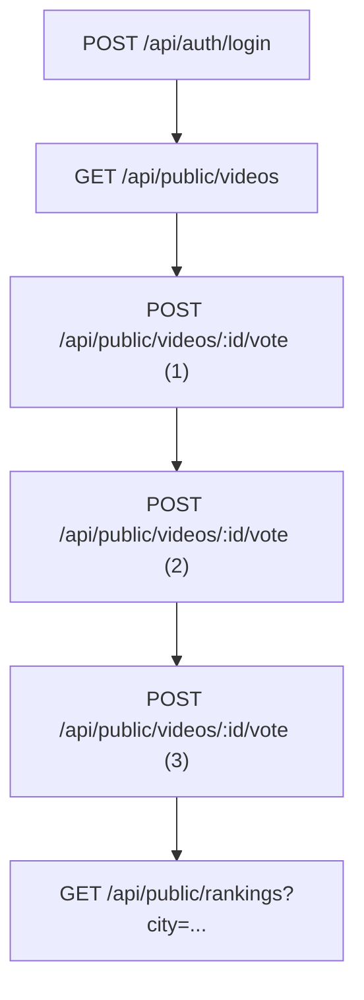
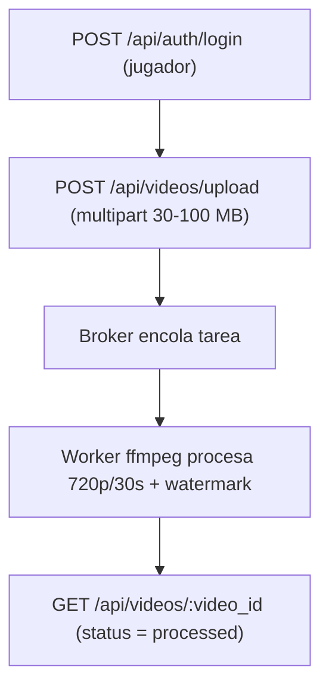

# Análisis Pruebas de Carga

**Proyecto: Entrega 2 — Desarrollo de Soluciones Cloud**  
**Documento:** Análisis Pruebas de Carga  
**Programa:** Maestría en Arquitecturas de Tecnologías de Información — Ingeniería de Sistemas y Computación, Universidad de los Andes  
**Ubicación:** Bogotá D. C.

## Integrantes
- Ricardo Andres Leyva Osorio — r.leyva@uniandes.edu.co
- Edda Camila Rodriguez Mojica — ec.rodriguez@uniandes.edu.co
- Cristian David Paredes Bravo — c.paredesb@uniandes.edu.co
- Andrea Carolina Cely Duarte — a.celyd@uniandes.edu.co
- Juan Carlos Martinez Muñoz — jc.martinezm1@uniandes.edu.co

---

## Contenido
- [Introducción](#introducción)
- [1. Entorno e Infraestructura](#1-entorno-e-infraestructura)
  - [1.1. Infraestructura del Generador de Carga](#11-infraestructura-del-generador-de-carga)
  - [1.2. Infraestructura de la solución (AWS)](#12-infraestructura-de-la-solución-aws)
- [2. Rutas críticas](#2-rutas-críticas)
  - [2.1. Escenario Interactivo](#21-escenario-interactivo)
  - [2.2. Escenario Carga/Asíncrono (Uploads)](#22-escenario-cargaasíncrono-uploads)
- [3. Escenarios de pruebas](#3-escenarios-de-pruebas)
  - [3.1. Prueba de Carga TG – Interactivo (login → listar → votar×3 → ranking)](#31-prueba-de-carga-tg--interactivo-login--listar--votar3--ranking)
  - [3.2. Prueba de Carga TG – Upload (login → upload multipart 30–100 MB)](#32-prueba-de-carga-tg--upload-login--upload-multipart-30100-mb)
- [4. Estrategia y configuración de pruebas](#4-estrategia-y-configuración-de-pruebas)
  - [4.1. Configuración](#41-configuración)
  - [4.2. Definición de métricas](#42-definición-de-métricas)
- [5. Resultados de las pruebas](#5-resultados-de-las-pruebas)
  - [5.1. Pruebas de humo](#51-pruebas-de-humo)
  - [5.2. Pruebas de carga Escalonada – TG-Interactivo](#52-pruebas-de-carga-escalonada--tg-interactivo)
  - [5.3. Pruebas de carga Escalonada – TG-Upload](#53-pruebas-de-carga-escalonada--tg-upload)
  - [5.4. Pruebas de estrés](#54-pruebas-de-estrés)
- [6. Análisis y conclusiones](#6-análisis-y-conclusiones)
- [7. Recomendaciones para futuras versiones](#7-recomendaciones-para-futuras-versiones)
- [8. Conclusión](#8-conclusión)

---

## Introducción
Este informe resume el resultado de las pruebas de humo y las pruebas de carga escalonadas ejecutadas sobre dos rutas críticas del **Sistema de Video y Ranking**. Las pruebas sobre los escenarios **Interactivo** y **Upload** permiten visualizar el comportamiento del sistema a medida que aumentan los usuarios concurrentes, comparando los resultados frente a los criterios del Plan de Pruebas. (Ver )

---

## 1. Entorno e Infraestructura

### 1.1. Infraestructura del Generador de Carga
- **Equipo:** Intel i7-12700H, 16 GB RAM, Windows 11 Pro 22H2.

### 1.2. Infraestructura de la solución (AWS)
La aplicación se ejecuta en AWS sobre instancias EC2 tipo **t3.small** para el **frontend** (SPA público) y el **backend**, un **t3.large** para los **workers** que procesan tareas en segundo plano, y otros servicios de apoyo (RabbitMQ, Redis, MinIO), con el fin de escalar horizontalmente y reducir cuellos de botella.

**Tabla 1. Infraestructura de la solución**

| Componente | Descripción |
|---|---|
| **Front (t3.small)** | Servidor web/SPA público. |
| **Back (t3.small)** | API/servicio de negocio, accesible desde Front y Worker. |
| **Worker (t3.large)** | Procesa tareas en segundo plano; más CPU/RAM que el resto. |
| **RabbitMQ (t3.small)** | Message broker para desacoplar Back y Worker. |
| **Redis-ec2 (t3.small)** | Caché/cola rápida o sesión. Sin IP pública, para uso interno. |
| **MinIO (t3.small)** | Almacenamiento de objetos S3-compatible; expuesto con IP pública. |
| **Bastion (t3.micro)** | “Jump host” para SSH hacia las instancias privadas. |

---

## 2. Rutas críticas

### 2.1. Escenario Interactivo
- **Objetivo:** Validar latencia y unicidad de voto con navegación realista.  
- **Flujo:** Login → listar videos disponibles → votar ×3 → consultar ranking.

**Figura 1. Flujo Escenario Interactivo**  

### 2.2. Escenario Carga/Asíncrono (Uploads)
- **Objetivo:** Someter la ingestión y el pipeline asíncrono.  
- **Flujo:** Login → carga de video (upload).

**Figura 2. Flujo Escenario Upload**  

---

## 3. Escenarios de pruebas

### 3.1. Prueba de Carga TG – Interactivo (login → listar → votar×3 → ranking)
Se ejecuta una prueba de carga escalonada con las siguientes etapas:
- **Inicio sin carga:** `rate(0/sec)` durante **10 s**.
- **Carga inicial baja:** `rate(10/sec)` durante **1 min**.
- **Incremento moderado:** transición a `rate(50/sec)` en **10 s**; mantener **1 min**.
- **Carga alta:** transición a `rate(100/sec)` en **10 s**; mantener **1 min**.
- **Descenso progresivo:** reducir a `rate(50/sec)` en **10 s**; mantener **1 min**.
- **Vuelta a carga baja:** reducir a `rate(10/sec)` en **10 s**; mantener **1 min**.

**Figura 3. Escenario de carga flujo Interactivo**  

### 3.2. Prueba de Carga TG – Upload (login → upload multipart 30–100 MB)
Prueba de carga escalonada:
- **Inicio en reposo:** `rate(0/sec)` durante `random_arrivals(10 s)`.
- **Incremento gradual:** `rate(2/sec)` → `rate(4/sec)` → `rate(6/sec)` → `rate(10/sec)` con duraciones de `random_arrivals(2 min, 1 min, 1 min, 1 min)`.
- **Descenso gradual:** `rate(6/sec)` → `rate(4/sec)` → `rate(2/sec)` con `random_arrivals(1 min, 1 min, 2 min)`.

**Figura 4. Escenario de carga flujo Upload**  

---

## 4. Estrategia y configuración de pruebas

### 4.1. Configuración
**Tabla 2. Configuración de Pruebas**

| Flujo | Etapas | Configuración |
|---|---|---|
| **TG-Interactivo** | Humo | 1 usuario, 1 min |
|  | Carga progresiva | 10 → 50 → 100 → 50 → 10 usuarios concurrentes (1–2 min por escalón) |
|  | Estrés | Subir hasta p95 > 1 s o error > 1% |
| **TG-Upload** | Humo | 1 usuario, 1 min |
|  | Carga progresiva | 2 → 4 → 6 → 10 → 6 → 4 → 2 usuarios concurrentes (1–2 min por escalón) |
|  | Estrés | Subir hasta p95 > 1 s o error > 1% |

### 4.2. Definición de métricas
**Tabla 3. Definición de métricas**

| Flujo | Configuración |
|---|---|
| **TG-Interactivo** | Foco en **p95** por endpoint; objetivo inicial ≤ **1000 ms** |
| **TG-Upload (ingestión multipart)** | Objetivo inicial **p95 ≤ 5 s** |

---

## 5. Resultados de las pruebas

### 5.1. Pruebas de humo
Las pruebas de humo validaron el correcto funcionamiento de los flujos antes de cargas altas. En el flujo interactivo se realizaron 12 peticiones (login, listados, tres votos y ranking) y en el flujo de subida 4 peticiones (login y subida). Se observan tiempos de respuesta promedio entre **1 y 7 s** y **100% de éxito** en la mayoría de pasos, excepto en algunos votos con errores de unicidad (idempotencia).

**Tabla 4. Resultados Pruebas de Humo**

| Escenario | Flujo/etiqueta | Nº peticiones | p50 (ms) | p95 (ms) | Máx (ms) | Éxito |
|---|---|---:|---:|---:|---:|---:|
| Flujo interactivo | Auth / Login (Interactivo) | 2 | 3 696 | 6 805 | 7 151 | 100% |
|  | Public / List videos | 2 | 1 705 | 3 161 | 3 323 | 100% |
|  | Public / Vote video (1) | 2 | 1 800 | 3 335 | 3 506 | 0% |
|  | Public / Vote video (2) | 2 | 4 472 | 6 097 | 6 277 | 0% |
|  | Public / Vote video (3) | 2 | 1 280 | 2 274 | 2 384 | 0% |
|  | Ranking / Get rankings | 2 | 5 732 | 6 658 | 6 761 | 100% |
| Flujo de subida (Upload) | Auth / Login (Upload) | 2 | 202 | 249 | 254 | 100% |
|  | Videos / Upload (multipart) | 2 | 44 440 | 45 258 | 45 349 | 100% |

> **Nota:** En **Vote**, el 0% de éxito se debe a que el video ya había sido votado por el usuario logueado; el backend devuelve error de unicidad (no es un problema de disponibilidad).

### 5.2. Pruebas de carga Escalonada – TG-Interactivo
Se procesaron **89 309 solicitudes**. Resumen estadístico por etiqueta (p50/p90/p95/p99):

**Tabla 5. Resultados Prueba de Carga Flujo Interactivo**

| Etiqueta | Nº peticiones | p50 (ms) | p90 (ms) | p95 (ms) | p99 (ms) | Éxito |
|---|---:|---:|---:|---:|---:|---:|
| Auth / Login | 15 329 | 21 030 | 36 765 | 43 429 | 125 723 | 22,5% |
| Public / List videos | 15 060 | 8 389 | 21 090 | 37 888 | 129 221 | 43,3% |
| Public / Vote video (1) | 14 804 | 716 | 21 041 | 21 052 | 39 971 | 5,05% |
| Public / Vote video (2) | 14 777 | 3 470 | 21 044 | 21 054 | 50 111 | 0,26% |
| Public / Vote video (3) | 14 714 | 3 313 | 21 043 | 21 051 | 46 299 | 0,16% |
| Ranking / Get rankings | 14 625 | 10 519 | 23 631 | 46 365 | 112 017 | 47,0% |

**Figura 5. Throughput vs Latencia (Interactivo)**  
")

**Figura 6. Comportamiento de la infraestructura durante la prueba (Interactivo)**  
")

**Figura 7. Comportamiento de la infraestructura al finalizar (Interactivo)**  
")

### 5.3. Pruebas de carga Escalonada – TG-Upload
Se procesaron **5 077 solicitudes**. La subida multipart mostró latencias significativamente mayores.

**Tabla 6. Resultados Prueba de Carga Flujo Upload**

| Etiqueta | Nº peticiones | p50 (ms) | p90 (ms) | p95 (ms) | p99 (ms) | Éxito |
|---|---:|---:|---:|---:|---:|---:|
| Auth / Login | 2 604 | 19 748 | 29 395 | 47 049 | 296 008 | 72% |
| Videos / Upload (multipart) | 2 473 | 142 357 | 284 162 | 312 809 | 338 083 | 1,6% |

**Figura 8. Throughput vs Latencia (Upload)**  
")

**Figura 9. Comportamiento de la infraestructura durante la prueba (Upload)**  
")

### 5.4. Pruebas de estrés
Se omitió la ejecución de estrés dada la baja tasa de éxito en carga escalonada.

---

## 6. Análisis y conclusiones
El sistema, en su configuración actual, **no cumple** los criterios de aceptación. Los p95 superan con amplitud **1000 ms** (web) y **5 s** (subidas), y la tasa de errores es alta.

Conclusiones principales:
1. **Saturación de recursos:** uso de **t3.small** (2 vCPU, 2 GB RAM) en front y back resulta insuficiente para ~100 usuarios concurrentes. **Migrar** a instancias más potentes (p. ej., **t3.medium/t3.large** para front/back y **c6i.large/xlarge** para workers).
2. **Escalado horizontal:** implementar **Auto Scaling Group** para el backend detrás de un **ELB**; mantener p95 < 1 s requiere CPU/RAM no saturadas.
3. **Optimización de base de datos:** cuellos de botella en voto/ranking; revisar **índices** y **pool de conexiones**.
4. **Cliente de carga adecuado:** ejecutar JMeter en una instancia dedicada (**c6i.xlarge** o **m6i.large**) para cargas realistas.

---

## 7. Recomendaciones para futuras versiones
Para una **versión 2** capaz de atender cientos de usuarios concurrentes:
1. **Incrementar capacidad del backend:** escalar a **t3.large** o **m6i.large** (2–4 vCPU, 8 GB RAM) y habilitar **auto-scaling** por CPU/latencia.
2. **Escalar workers de procesamiento:** usar **c6i.large/xlarge** y aumentar el número de workers (4–8 para ~100 subidas simultáneas).
3. **Almacenamiento escalable:** usar **URLs prefirmadas (signed URLs)** para subir directamente al almacenamiento y descargar el backend.

---

## 8. Conclusión
El sistema no sostiene las cargas objetivo definidas. Las pruebas de humo confirmaron funcionalidad básica, pero la carga escalonada evidenció tiempos de respuesta > **30 s** e incluso **minutos**. Para alcanzar los criterios de aceptación se requiere dimensionamiento adecuado, optimización de base de datos y mecanismos de **escalado automático**, además de **monitoreo** de consumo de CPU/RAM por componente.

