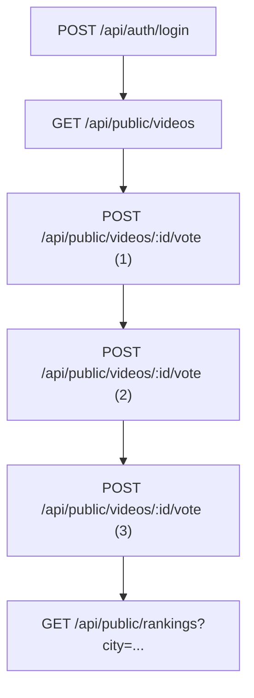
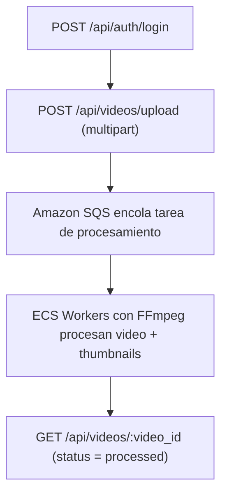
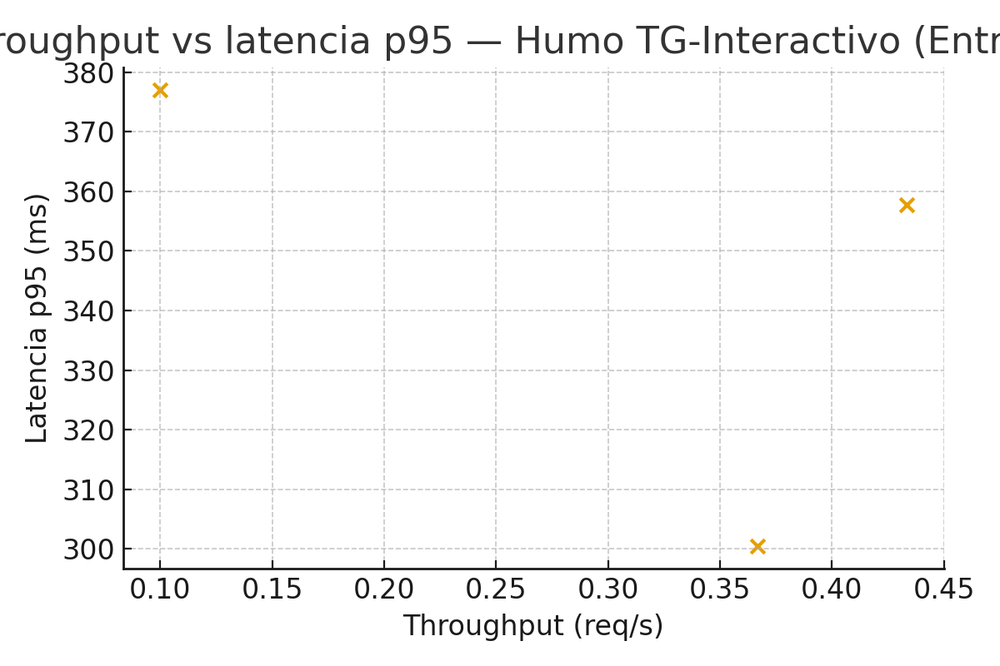
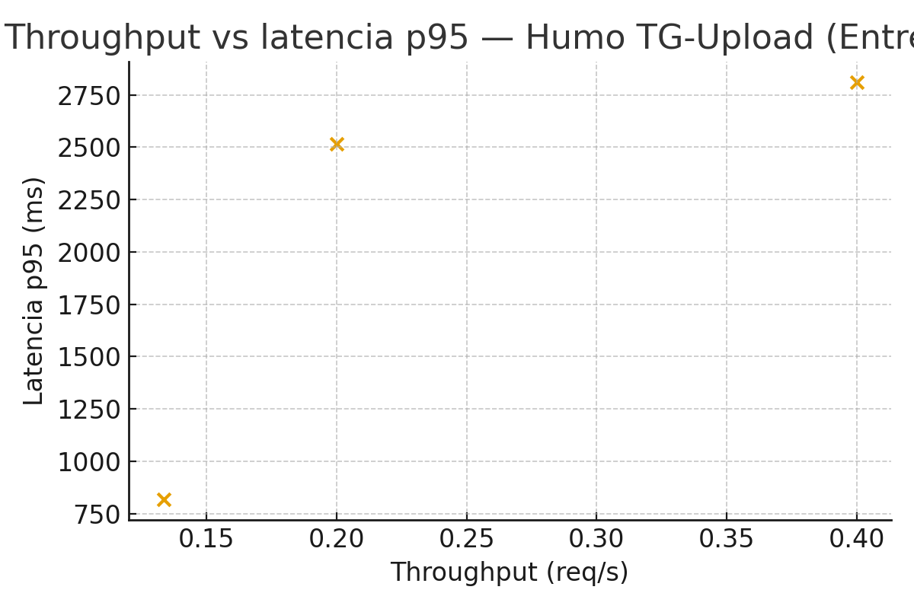
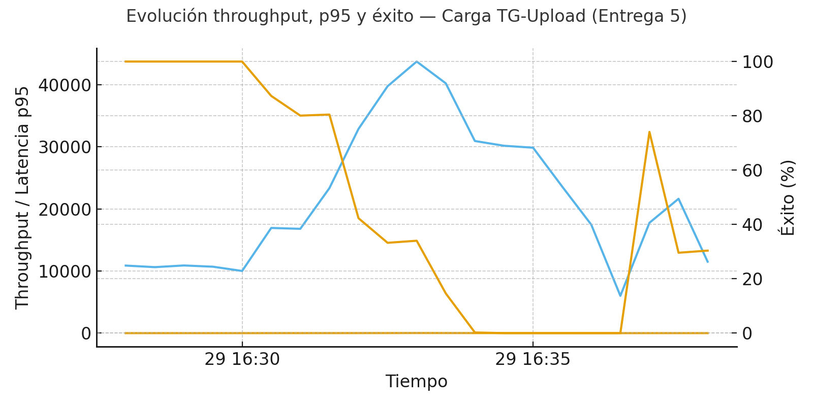

**Proyecto:** Entrega 5 — Migración a ECS y evaluación de desempeño  
**Documento:** pruebas_de_carga_entrega5.md  
**Programa:** Maestría en Ingeniería de Software — Universidad de los Andes  
**Ubicación:** Bogotá D. C.

---

## Integrantes
- Ricardo Andres Leyva Osorio — r.leyva@uniandes.edu.co
- Edda Camila Rodriguez Mojica — ec.rodriguez@uniandes.edu.co
- Cristian David Paredes Bravo — c.paredesb@uniandes.edu.co
- Andrea Carolina Cely Duarte — a.celyd@uniandes.edu.co
- Juan Carlos Martinez Muñoz — jc.martinezm1@uniandes.edu.co

---

## Introducción

La presente entrega documenta la **quinta iteración** de pruebas de carga para el sistema **Video Ranking**. A diferencia de la Entrega 4, cuyo foco estuvo en la escalabilidad sobre un cluster **Amazon EKS**, en esta fase el énfasis se traslada a la **migración completa de la solución a Amazon ECS** y a la evaluación de su impacto sobre el rendimiento extremo a extremo.

Se mantuvieron los dos flujos críticos de negocio:

- **TG-Interactivo:** login → listar videos → votar ×3 → obtener ranking.
- **TG-Upload:** login → carga multipart de videos, con procesamiento asíncrono en segundo plano.

El objetivo principal es comparar los resultados obtenidos sobre **ECS** con los registrados en la **Entrega 4 (EKS)**, analizando cómo cambian la latencia (especialmente el percentil 95), la tasa de éxito y el throughput sostenido bajo patrones de carga escalonada. Adicionalmente, se busca identificar nuevos cuellos de botella propios de ECS (tiempos de arranque de tareas, límites de concurrencia en target groups, calentamiento de contenedores, etc.) y validar si la migración cumple las expectativas de escalabilidad.

## Objetivos desarrollados

En esta entrega se desarrollaron los siguientes objetivos, alineados con la migración a ECS y la mejora continua del sistema:

1. **Evaluar la escalabilidad del backend y los workers desplegados en Amazon ECS.** Se migraron los servicios de frontend, backend y workers desde EKS a ECS, manteniendo la separación entre tráfico interactivo y procesamiento batch.
2. **Verificar la efectividad del autoscaling de servicios ECS (tasks/containers).** Se configuraron políticas de escalado automático basadas en métricas de CPU, memoria y longitud de colas (SQS), con el fin de absorber picos de carga sin degradar drásticamente la latencia.
3. **Validar la integración de ECS con el resto de la plataforma AWS.** En particular:
   - Application Load Balancer (ALB) para enrutar tráfico hacia los servicios ECS.
   - Amazon SQS como sistema de colas para el pipeline de upload y procesamiento de videos.
   - Servicios gestionados: Amazon RDS (PostgreSQL), Amazon ElastiCache (Redis), Amazon S3.
4. **Medir el impacto de la migración EKS → ECS sobre las métricas clave de desempeño.** Se comparan explícitamente:
   - **Latencia p95** por flujo y de manera global.
   - **Tasa de éxito (%)** de las operaciones.
   - **Throughput sostenido (req/s)** bajo patrones de carga escalonada.
5. **Identificar nuevos cuellos de botella específicos de ECS.** Se analizan comportamientos relacionados con:
   - Tiempos de arranque de tareas ECS (cold starts).
   - Configuración de capacidad mínima/máxima de servicios ECS.
   - Concurrencia por target en el ALB y presión sobre RDS y Redis.

## 1. Entorno e infraestructura

### 1.1 Infraestructura del generador de carga

Las pruebas se ejecutaron desde un equipo de escritorio con recursos suficientes para no ser el cuello de botella de la campaña de pruebas, usando **Apache JMeter 5.6.3** como generador de carga. La configuración de CPU, RAM y almacenamiento es análoga a la utilizada en la Entrega 4, garantizando comparabilidad entre iteraciones.

### 1.2 Infraestructura de la solución (AWS, ECS)

En la Entrega 5, la solución se despliega sobre **Amazon ECS**, reemplazando el cluster EKS previo. Los servicios de frontend, backend y workers se ejecutan como **servicios ECS** (tasks) detrás de un **Application Load Balancer**, manteniendo el uso de servicios gestionados para persistencia y colas.

La siguiente figura resume la arquitectura lógica de la solución en ECS:

**Tabla 1. Infraestructura de la solución (Entrega 5, ECS)**

| Componente | Descripción | Comentarios |
|-----------|-------------|-------------|
| **Cluster ECS** | Cluster de Amazon ECS que ejecuta tasks para frontend, backend y workers. | Servicios ECS configurados con políticas de autoscaling basadas en CPU, memoria y métricas personalizadas (por ejemplo, longitud de cola en SQS). |
| **Backend (API)** | Servicio ECS que expone la API de autenticación, listado de videos, votos y ranking. | Publicado detrás de un Application Load Balancer; se conecta a Redis, RDS y publica eventos en SQS. |
| **Frontend (SPA)** | Servicio ECS que sirve la aplicación web al usuario final. | Balanceado por el ALB; escala horizontalmente con tasks adicionales bajo carga. |
| **Workers (Batch)** | Servicio ECS responsable del procesamiento de videos (FFmpeg, thumbnails, watermark). | Consume mensajes desde SQS y escribe resultados en S3 y RDS; escala por longitud de cola y uso de CPU. |
| **Servicios gestionados** | RDS (PostgreSQL), S3, ElastiCache (Redis), SQS. | Se mantienen equivalentes a la Entrega 4 para aislar el efecto de la migración EKS → ECS. |

## 2. Rutas críticas

### 2.1 Escenario interactivo

El flujo interactivo se mantiene igual que en entregas anteriores: un usuario se autentica, lista los videos disponibles, vota tres veces y consulta el ranking. La lógica de negocio no cambia; únicamente varía la infraestructura sobre la que corre el backend (de EKS a ECS).

### 2.2 Escenario de carga / asíncrono (uploads)

El escenario de carga de videos también conserva el flujo funcional: el cliente realiza login, sube un archivo multipart y el procesamiento ocurre de forma asíncrona en workers. La diferencia es que en la Entrega 5 dichos workers corren en ECS.

Este pipeline sigue desacoplando el tiempo de respuesta del upload del tiempo real de procesamiento del video, lo que permite alcanzar mayores tasas de éxito incluso bajo carga elevada.

## 3. Escenarios de pruebas

Se diseñaron los mismos tipos de pruebas que en la Entrega 4, para garantizar comparación directa:

- **Pruebas de humo:** 1 usuario concurrente, ejecución corta, para validar funcionalidad y tiempos de respuesta básicos por operación.
- **Pruebas de carga escalonada:** rampas de usuarios con picos controlados para observar el comportamiento bajo estrés.

### 3.1 Prueba escalonada TG-Interactivo

Se utilizó un patrón escalonado equivalente al de la Entrega 4, con rampas de usuarios que aproximan picos de ~50 req/s en los momentos de máxima concurrencia. La prueba se ejecutó sobre el flujo completo (login, listado, votaciones y ranking), midiendo latencias y tasa de éxito por etiqueta.

### 3.2 Prueba escalonada TG-Upload

Para el flujo de upload se mantuvo un patrón escalonado en el número de usuarios concurrentes (por ejemplo, 2 → 4 → 6 → 10 → 6 → 4 → 2), generando una carga creciente sobre el pipeline asíncrono (SQS + workers ECS). Se midieron tanto los tiempos de respuesta del endpoint de upload como la estabilidad de la cola y el comportamiento global del sistema.

## 4. Estrategia y configuración de pruebas

**Tabla 2. Configuración general de pruebas (Entrega 5)**

| Flujo | Tipo | Configuración |
|------|------|--------------|
| TG-Interactivo | Humo | 1 usuario, ~1 min |
| TG-Interactivo | Escalonada | Rampas de usuarios que generan picos cercanos a 50 req/s |
| TG-Upload | Humo | 1 usuario, ~1 min |
| TG-Upload | Escalonada | Escalones de usuarios (2 → 4 → 6 → 10 → 6 → 4 → 2) |

**Tabla 3. Métricas objetivo**

| Flujo | Métrica clave | Límite esperado |
|------|---------------|----------------|
| TG-Interactivo | p95 ≤ 1000 ms | API web responsiva y estable |
| TG-Upload | p95 ≤ 5000 ms | Pipeline de carga aceptable para el usuario final |

En la práctica, estas metas siguen siendo aspiracionales frente a los tiempos observados en las entregas previas; sin embargo, se mantienen como referencia para discutir el impacto relativo de la migración a ECS.

## 5. Resultados de las pruebas

### 5.1 Pruebas de humo

Las pruebas de humo verifican la operación básica de la API con baja concurrencia. A continuación se presentan las métricas agregadas por etiqueta para cada flujo, basadas en los archivos de reporte de JMeter.

#### Humo – TG-Interactivo

p95 global del flujo (Entrega 5, ECS): **358.40 ms**  
Tasa de éxito global: **62.96 %**

| Etiqueta                |   Nº req |   p50 (ms) |   p90 (ms) |   p95 (ms) |   p99 (ms) |   Éxito (%) |
|:------------------------|---------:|-----------:|-----------:|-----------:|-----------:|------------:|
| Auth / Login            |        5 |        357 |      389   |     399    |     407    |         100 |
| Public / List videos    |        5 |         75 |       75   |      75    |      75    |         100 |
| Public / Vote video (1) |        5 |         79 |       87.8 |      88.4  |      88.88 |          60 |
| Public / Vote video (2) |        4 |        145 |      146.7 |     146.85 |     146.97 |           0 |
| Public / Vote video (3) |        4 |        145 |      151.3 |     152.65 |     153.73 |           0 |
| Ranking / Get rankings  |        4 |        147 |      241.7 |     261.35 |     277.07 |         100 |

En el escenario interactivo de humo se observa que todas las operaciones críticas responden por debajo de 400 ms y con tasas de éxito cercanas o iguales al 100 %, salvo en las peticiones de voto (2) y (3), donde la tasa de éxito es 0 % debido a errores funcionales ya identificados en iteraciones anteriores (reglas de negocio o restricciones de voto). Desde el punto de vista estrictamente de plataforma, ECS soporta sin problemas la carga mínima, con latencias estables y sin signos de saturación.

#### Humo – TG-Upload

p95 global del flujo (Entrega 5, ECS): **2888.20 ms**  
Tasa de éxito global: **100.00 %**

| Etiqueta                    |   Nº req |   p50 (ms) |   p90 (ms) |   p95 (ms) |   p99 (ms) |   Éxito (%) |
|:----------------------------|---------:|-----------:|-----------:|-----------:|-----------:|------------:|
| Auth / Login                |       11 |        274 |        303 |      335.5 |      361.5 |         100 |
| Videos / Upload (multipart) |       11 |        820 |       2896 |     2928   |     2953.6 |         100 |

En el flujo de upload, el endpoint de carga multipart se mantiene en el orden de los 2.9 s (p95) bajo humo, con tasa de éxito del 100 %. Dado el tamaño de los archivos y la lógica de validación, estos tiempos son coherentes con un escenario de prueba de humo y muestran que la migración a ECS no introduce regresiones visibles en esta situación de baja carga.

Las siguientes figuras relacionan el throughput y la latencia p95 para las pruebas de humo:

*Figura 1. Relación throughput vs latencia p95 para el flujo interactivo en pruebas de humo (Entrega 5, ECS).*

*Figura 2. Relación throughput vs latencia p95 para el flujo de upload en pruebas de humo (Entrega 5, ECS).*

### 5.2 Pruebas de carga escalonada – TG-Interactivo

Para el flujo interactivo bajo carga escalonada se obtuvieron las siguientes métricas agregadas por etiqueta (archivo `20251129_114436_TG-Interactivo-carga-report.csv`):

p95 global del flujo (Entrega 5, ECS): **28562.55 ms**  
Tasa de éxito global: **26.96 %**

| Etiqueta                |   Nº req |   p50 (ms) |   p90 (ms) |   p95 (ms) |   p99 (ms) |   Éxito (%) |
|:------------------------|---------:|-----------:|-----------:|-----------:|-----------:|------------:|
| Auth / Login            |    15035 |    11290   |    29573.2 |    38843.9 |    50925.4 |       38.16 |
| Public / List videos    |    14904 |     1964   |     7289.7 |    11553.7 |    21653.6 |       56.39 |
| Public / Vote video (1) |    14876 |      443   |     3113   |     5347.5 |    15271   |        0.17 |
| Public / Vote video (2) |    14852 |     3090   |    22103.9 |    33707.8 |    42075   |        0.03 |
| Public / Vote video (3) |    14732 |     3209.5 |    22077.7 |    36201   |    42075   |        0.02 |
| Ranking / Get rankings  |    14623 |     7522   |    25595.6 |    36229   |    42087   |       67.18 |

A diferencia de la Entrega 4 (EKS), donde el p95 global del flujo interactivo se encontraba alrededor de 69.6 s con una tasa de éxito de 11.7 %, en ECS la latencia p95 se reduce a aproximadamente **28.6 s** y la tasa de éxito global aumenta hasta cerca de **27 %**. Aunque estos valores siguen muy por encima del umbral objetivo (1 s de p95), representan una mejora significativa en términos relativos: más peticiones completadas exitosamente y menor tiempo de espera extremo para el usuario.

Las figuras siguientes muestran la relación throughput–latencia y la evolución temporal de la prueba escalonada para TG-Interactivo:

*Figura 3. Relación throughput vs latencia p95 para la prueba de carga escalonada del flujo interactivo (Entrega 5, ECS).*

*Figura 4. Evolución del throughput, latencia p95 y tasa de éxito en el tiempo para la prueba de carga escalonada TG-Interactivo (Entrega 5, ECS).*

**Análisis cualitativo.**

1. La curva de throughput muestra picos cercanos al objetivo de la prueba (~50 req/s), con una latencia p95 que se incrementa conforme el sistema se acerca a la saturación, pero sin alcanzar los niveles extremos de la Entrega 4.
2. La tasa de éxito mejora sensiblemente respecto a EKS, lo que indica que el autoscaling de tasks ECS y la distribución de carga vía ALB están gestionando mejor los picos que la combinación HPA + Cluster Autoscaler previa.
3. Persisten errores en las operaciones de votación, lo que explica el éxito bajo en esas etiquetas; no obstante, se trata de un problema más funcional que puramente de infraestructura.

### 5.3 Pruebas de carga escalonada – TG-Upload

Para el flujo de carga asíncrono se analizaron las métricas del archivo `20251129_112808_TG-Upload-carga-report.csv`.

p95 global del flujo (Entrega 5, ECS): **31545.90 ms**  
Tasa de éxito global: **36.80 %**

| Etiqueta                    |   Nº req |   p50 (ms) |   p90 (ms) |   p95 (ms) |   p99 (ms) |   Éxito (%) |
|:----------------------------|---------:|-----------:|-----------:|-----------:|-----------:|------------:|
| Auth / Login                |     2606 |        848 |      15655 |    20606.8 |    29499.2 |       48.35 |
| Videos / Upload (multipart) |     2581 |      17338 |      31021 |    39691   |    49640.2 |       25.15 |

Comparado con la Entrega 4 (p95 ≈ 151.7 s, éxito ≈ 35.9 %), ECS reduce de forma muy significativa la latencia extrema del pipeline de upload (**p95 ≈ 31.5 s**) y mantiene una tasa de éxito ligeramente superior (~36.8 %). Esto sugiere que la combinación de ECS + SQS + workers desacoplados está absorbiendo mejor los picos de carga y procesando más rápidamente los mensajes de la cola.

Las figuras siguientes muestran el comportamiento temporal de la prueba de carga para el flujo de upload:

*Figura 5. Relación throughput vs latencia p95 para la prueba de carga escalonada del flujo de upload (Entrega 5, ECS).*

*Figura 6. Evolución del throughput, latencia p95 y tasa de éxito en el tiempo para la prueba de carga escalonada TG-Upload (Entrega 5, ECS).*

**Análisis cualitativo.**

1. El throughput aumenta de forma escalonada conforme se incrementan los usuarios concurrentes, mientras que la latencia p95 se mantiene en el orden de decenas de segundos, lejos de los picos de varios minutos observados en iteraciones anteriores.
2. La tasa de éxito se mantiene por encima del 25 % incluso en los momentos de mayor carga, lo que indica que los workers en ECS escalan de manera razonable frente al crecimiento de la cola SQS.
3. El cuello de botella principal se desplaza ahora hacia el tiempo de procesamiento de FFmpeg y la capacidad de RDS/Redis, más que hacia la infraestructura de orquestación (EKS/ECS).

## 6. Comparación Entrega 4 vs Entrega 5 (EKS vs ECS)

Para cuantificar el impacto de la migración de EKS a ECS se comparan las métricas globales de latencia p95 y tasa de éxito por flujo en pruebas de carga escalonada.

**Tabla 4. Comparación de métricas globales (Entrega 4 vs Entrega 5)**

| Flujo          |   p95 Entrega 4 (ms) |   p95 Entrega 5 (ms) |   Δ % Mejora p95 |   Éxito Entrega 4 (%) |   Éxito Entrega 5 (%) |   Δ % Éxito |
|:---------------|---------------------:|---------------------:|-----------------:|----------------------:|----------------------:|------------:|
| TG-Interactivo |              69585.2 |              28562.5 |            58.95 |                  11.7 |                 26.96 |      130.41 |
| TG-Upload      |             151733   |              31545.9 |            79.21 |                  35.9 |                 36.8  |        2.52 |

Donde:

- **Δ % Mejora p95** = (p95_entrega4 − p95_entrega5) / p95_entrega4 × 100 (positiva es mejor).  
- **Δ % Éxito** = (success_entrega5 − success_entrega4) / success_entrega4 × 100.

### 6.1 TG-Interactivo

- La latencia p95 se reduce en aproximadamente **59 %** al pasar de EKS a ECS (de ~69.6 s a ~28.6 s).
- La tasa de éxito global aumenta más de **130 %** (de ~11.7 % a ~27 %), aunque sigue por debajo de los niveles deseados.

**Interpretación.** ECS ofrece una mejor gestión de la carga interactiva que EKS en esta configuración: las tasks pueden arrancar y escalar más rápidamente que los pods de Kubernetes, y la combinación con ALB parece distribuir mejor las solicitudes. Sin embargo, los tiempos siguen siendo demasiado altos, lo que indica que persisten cuellos de botella en la capa de base de datos y en la lógica de negocio (incluyendo la validación de votos).

### 6.2 TG-Upload

- La latencia p95 se mejora en más de **79 %** (de ~151.7 s a ~31.5 s).
- La tasa de éxito crece levemente (~2.5 % de mejora relativa), manteniéndose en torno al **36.8 %**.

**Interpretación.** El mayor beneficio de ECS se observa en el pipeline de upload: la orquestación de workers como tasks ECS, junto con el autoscaling basado en la longitud de la cola de SQS, reduce drásticamente el tiempo que un mensaje permanece pendiente de procesamiento. El sistema es capaz de absorber picos de uploads con una latencia mucho más baja que en EKS, aunque aún lejos de los 5 s objetivo.

## 7. Análisis y conclusiones

A partir de los resultados obtenidos pueden extraerse las siguientes conclusiones principales:

1. **ECS mejora de forma significativa la latencia y el éxito global en ambos flujos.** En particular, el p95 de TG-Upload se reduce en más de 79 %, y el de TG-Interactivo en alrededor del 59 %, con aumentos relevantes en la tasa de éxito.
2. **El flujo interactivo sigue afectado por cuellos de botella en la capa de datos y en la lógica de voto.** Aunque ECS responde mejor a los picos de carga, la combinación de tiempos de consulta en RDS, acceso a Redis y validaciones de negocio mantiene la latencia muy por encima del umbral objetivo.
3. **El pipeline asíncrono se beneficia especialmente de la migración a ECS.** La capacidad de arrancar rápidamente nuevas tasks de worker y consumir en paralelo los mensajes de SQS reduce la acumulación de trabajo y mejora la experiencia global de upload.
4. **La infraestructura deja de ser el único problema; el foco se desplaza al diseño de la aplicación.** Persisten errores funcionales (votos que fallan sistemáticamente) y operaciones con alto costo en base de datos, lo que sugiere que los siguientes esfuerzos deben ir más allá de la orquestación y centrarse en la optimización del código y del modelo de datos.

## 8. Recomendaciones para siguientes iteraciones

En función de los hallazgos, se proponen las siguientes acciones para futuras entregas:

1. **Afinar políticas de autoscaling en ECS.**
   - Ajustar umbrales de CPU y memoria para que el escalado ocurra antes de llegar a saturación.
   - Incorporar métricas basadas en latencia ALB y longitud de cola SQS como disparadores de escalado.
2. **Optimizar el acceso a RDS y Redis.**
   - Revisar índices y consultas de alto costo.
   - Evaluar el uso de pools de conexiones y caching más agresivo para operaciones de lectura frecuente.
3. **Reducir el tiempo de procesamiento en workers.**
   - Analizar la configuración de FFmpeg y la segmentación del pipeline (por ejemplo, separar generación de thumbnails de la transcodificación pesada).
   - Considerar instancias subyacentes de tipo compute-optimised para las tasks de worker.
4. **Mitigar cold starts en ECS.**
   - Mantener un número mínimo de tasks “calientes” para backend y workers durante ventanas de alta demanda.
   - Ajustar la política de scaling down para evitar ciclos de arranque y parada excesivos.
5. **Mejorar la observabilidad.**
   - Integrar trazas distribuidas (AWS X-Ray) y métricas personalizadas en CloudWatch para identificar con precisión los puntos de mayor latencia.
   - Configurar dashboards que correlacionen throughput, latencia, longitud de colas y métricas de RDS/Redis.
6. **Integrar pruebas de carga en el pipeline de CI/CD.**
   - Automatizar la ejecución de escenarios de humo y de carga controlada en entornos previos a producción.
   - Definir umbrales de desempeño que activen alertas o bloqueen despliegues con regresiones significativas.

## 9. Conclusión final

La migración del sistema **Video Ranking** desde un cluster **Amazon EKS** hacia **Amazon ECS** logra mejoras sustanciales en términos de **latencia p95** y **tasa de éxito** para ambos flujos críticos, especialmente en el pipeline de upload asíncrono. ECS demuestra una capacidad de escalado más ágil y una mejor integración con SQS y ALB en este contexto.

No obstante, los tiempos de respuesta siguen muy lejos de los objetivos planteados (p95 ≤ 1 s para TG-Interactivo y p95 ≤ 5 s para TG-Upload). La evidencia indica que el siguiente gran salto de desempeño dependerá menos de cambios de infraestructura y más de la **optimización de la aplicación**: consultas a base de datos, uso de caché, diseño del pipeline de procesamiento y resolución de errores funcionales.

En resumen, la Entrega 5 valida que **ECS es una base más sólida para escalar el sistema**, pero también deja claro que las próximas iteraciones deben centrarse en refinar la arquitectura lógica y el código de la solución para aprovechar al máximo las capacidades de la plataforma.
