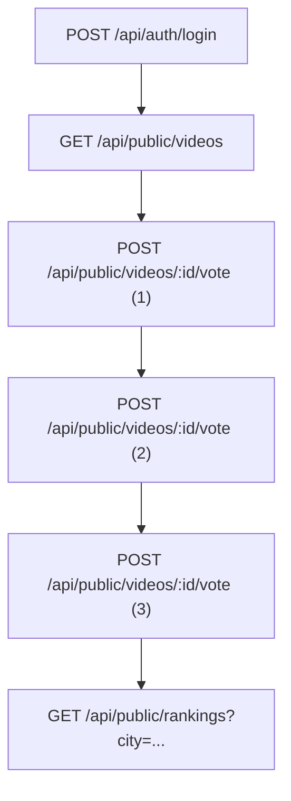
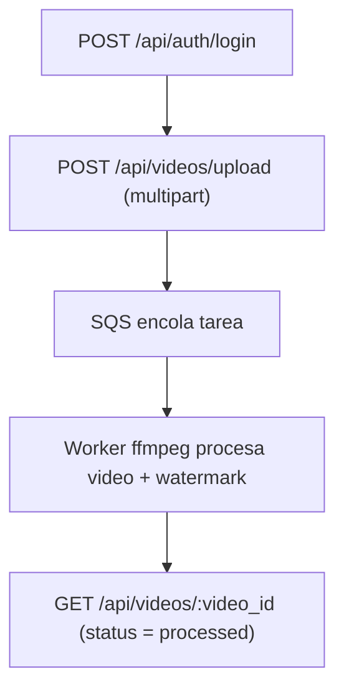

# Análisis Pruebas de Carga — Entrega 4

**Proyecto:** Entrega 4 — Escalabilidad en la Capa Batch/Worker  
**Documento:** pruebas_de_carga_entrega4.md  
**Programa:** Maestría en Ingeniería de Software — Universidad de los Andes  
**Ubicación:** Bogotá D. C.

---

## Integrantes
- Ricardo Andres Leyva Osorio — r.leyva@uniandes.edu.co
- Edda Camila Rodriguez Mojica — ec.rodriguez@uniandes.edu.co
- Cristian David Paredes Bravo — c.paredesb@uniandes.edu.co
- Andrea Carolina Cely Duarte — a.celyd@uniandes.edu.co
- Juan Carlos Martinez Muñoz — jc.martinezm1@uniandes.edu.co

---

## Introducción

La presente entrega documenta la **cuarta iteración** de pruebas de carga para el sistema **Video Ranking**.  A diferencia de la Entrega 3, el foco de esta fase se trasladó a la **escalabilidad de la capa batch/worker** y la modernización completa de la infraestructura.  Se migró el backend y los workers a un **cluster EKS** con políticas de autoscaling y se sustituyó RabbitMQ por **Amazon SQS** como sistema de colas.  Estos cambios permiten desacoplar los componentes y añadir o retirar nodos en función de la demanda.

Las pruebas se ejecutaron sobre los flujos **TG‑Interactivo** (login → listar → votar×3 → ranking) y **TG‑Upload** (login → carga multipart).  Utilizamos de referencia el informe de la Entrega 3 para comparar el impacto de la nueva infraestructura sobre el rendimiento, la estabilidad y la capacidad de respuesta del sistema.

---

## Objetivos desarrollados

En esta iteración se abordaron nuevos objetivos orientados a la escalabilidad y resiliencia de la solución.  A continuación se describen y se explica cómo se materializaron en la arquitectura y en las pruebas:

1. **Consideraciones técnicas para escalar en IaaS público:** se reemplazó el despliegue fijo de instancias EC2 por un **cluster EKS** con tres nodos worker.  EKS integra políticas de autoscaling de nodos y pods; el *Cluster Autoscaler* observa los pods no programados y añade o elimina nodos según sea necesario.
2. **Estrategia de despliegue y arranque sin intervención manual:** se configuraron *manifests* de Kubernetes para la API, el frontend y los workers.  Estas definiciones permiten escalar réplicas bajo demanda mediante *Horizontal Pod Autoscaler* (HPA) y reiniciar pods automáticamente tras fallos.
3. **Autoscaling de servidores web:** el *HPA* supervisa métricas de CPU y memoria de los pods de backend y frontend y ajusta el número de réplicas.  El *Cluster Autoscaler* amplía los nodos cuando las réplicas no caben en los nodos actuales.
4. **Autoscaling de procesos batch:** los pods de workers escalan horizontalmente en función de la longitud de la cola y del uso de CPU.  Cuando el clúster detecta pods pendientes, añade nodos nuevos; cuando la cola se vacía, reduce la capacidad.
5. **Balanceador de carga:** un load balancer expone el servicio web y distribuye el tráfico entre los pods.  El algoritmo de balanceo asigna las peticiones a los pods con menos conexiones activas, distribuyendo las solicitudes de forma adaptativa.
6. **Sistema escalable de paso de mensajes:** se sustituyó RabbitMQ por **Amazon SQS**.  SQS permite desacoplar productores y consumidores; actúa como una cola en la que las aplicaciones envían mensajes sin depender de la disponibilidad del consumidor y garantiza la entrega hasta que el receptor procesa el mensaje.
7. **Ejecutar pruebas de estrés en servidores web y procesos batch:** se diseñaron pruebas escalonadas para los flujos interactivo y de carga, evaluando el comportamiento del sistema en picos controlados de hasta 50 req/s en el web y 10 uploads/s en el pipeline asíncrono.

---

## 1. Entorno e infraestructura

### 1.1 Infraestructura del generador de carga

Las pruebas se ejecutaron desde un equipo con las siguientes características:

- **CPU:** AMD Ryzen 5 5600 (6 núcleos) @ 3.50 GHz.
- **RAM:** 32 GB (a 2400 MHz).
- **GPU:** NVIDIA GeForce RTX 2060 con 12 GB de VRAM.
- **Almacenamiento:** aprox. 2.75 TB (SSD + HDD).
- **Cliente de carga:** Apache JMeter 5.6.3.

### 1.2 Infraestructura de la solución (AWS)

La arquitectura de esta entrega abandona las instancias EC2 individuales y adopta un **cluster Amazon EKS** con autoscaling.  La figura siguiente resume la composición lógica del sistema desplegado:

**Tabla 1. Infraestructura de la solución**

| Componente | Descripción | Comentarios |
|-----------|-------------|-------------|
| **Cluster EKS (3 nodos)** | Clúster de Kubernetes gestionado. Cada nodo ejecuta pods de frontend, backend y workers. | Autoscaling de nodos mediante Cluster Autoscaler; integra métricas de pods para ampliar o reducir capacidad. |
| **Backend (API)** | Despliegue de pods que exponen la API principal para login, listado de videos, votaciones y ranking. | Escala horizontalmente con HPA; se conecta a Redis, RDS y publica tareas en SQS. |
| **Frontend (SPA)** | Pods que sirven la single‑page application pública. | Se balancean detrás del load balancer; escalan según demanda. |
| **Workers (Batch)** | Pods encargados del procesamiento de video y generación de thumbnails. | Consumen mensajes desde SQS, usan FFmpeg y suben resultados a S3; escalan según cola y CPU. |
| **Servicios gestionados** | Redis Cache, SQS, S3, RDS (PostgreSQL). | Redis almacena sesiones/caché; SQS asegura comunicación asíncrona y desacoplamiento; S3 almacena archivos de video; RDS guarda metadatos. |

Esta arquitectura elimina la dependencia de un número fijo de instancias y permite escalar de manera dinámica tanto los pods como los nodos.  El load balancer de Kubernetes reparte las solicitudes entrantes entre los pods disponibles; los algoritmos de balanceo más comunes, como *least connection*, asignan las peticiones al pod con menor número de conexiones activas, distribuyendo equitativamente la carga.

---

## 2. Rutas críticas

### 2.1 Escenario interactivo

El flujo interactivo consiste en autenticarse, consultar la lista de videos, votar tres veces y obtener el ranking.  No presenta cambios funcionales frente a la Entrega 3, pero ahora está soportado por la API desplegada en Kubernetes.

### 2.2 Escenario de carga/Asíncrono (uploads)

Para el flujo de carga se autenticó al usuario y se realizó un upload multipart de archivos entre 12 y 52 MB.  La principal diferencia respecto a la Entrega 3 es que en lugar de enviar la tarea a RabbitMQ se **publica un mensaje en SQS**.  Los workers consumen los mensajes y procesan los videos en segundo plano.

---

## 3. Escenarios de pruebas

### 3.1 Prueba escalonada TG‑Interactivo

El patrón de carga se mantuvo respecto a la entrega anterior: se generan picos de tráfico con periodos de rampa y pausas intermedias.  Se simulan tres fases: 10 req/s → 50 req/s → 10 req/s, con pausas de 2, 4 y 2 minutos, respectivamente.  La figura siguiente muestra el throughput, la latencia p95 y la tasa de éxito a lo largo de la prueba escalonada para el flujo interactivo.

### 3.2 Prueba escalonada TG‑Upload

Para el flujo de carga se aplicó un patrón escalonado con usuarios concurrentes: 2 → 4 → 6 → 10 → 6 → 4 → 2.  La figura muestra la evolución del throughput, la latencia p95 y la tasa de éxito en el pipeline asíncrono.

---

## 4. Estrategia y configuración de pruebas

**Tabla 2. Configuración general de pruebas**

| Flujo | Tipo | Configuración |
|------|------|--------------|
| TG‑Interactivo | Humo | 1 usuario, 1 min |
| | Escalonada | 10 → 50 → 10 usuarios concurrentes |
| TG‑Upload | Humo | 1 usuario, 1 min |
| | Escalonada | 2 → 4 → 6 → 10 → 6 → 4 → 2 usuarios |

**Tabla 3. Métricas objetivo**

| Flujo | Métrica clave | Límite esperado |
|------|---------------|----------------|
| TG‑Interactivo | p95 ≤ 1000 ms | Estabilidad de la API web |
| TG‑Upload | p95 ≤ 5 s | Desempeño del pipeline asíncrono |

---

## 5. Resultados de las pruebas

### 5.1 Pruebas de humo

Las pruebas de humo verifican la operación básica de la API bajo un usuario concurrente.  Las métricas registradas se resumen en la siguiente tabla.

| Etiqueta | Nº req | p50 (ms) | p90 (ms) | p95 (ms) | p99 (ms) | Éxito (%) |
|---|---|---|---|---|---|---|
| Auth / Login | 5 | 223.0 | 314.8 | 338.4 | 357.28 | 100.0 |
| Public / List videos | 5 | 79.0 | 80.8 | 81.4 | 81.88 | 100.0 |
| Public / Vote video (1) | 5 | 81.0 | 82.2 | 82.6 | 82.92 | 80.0 |
| Public / Vote video (2) | 5 | 145.0 | 146.8 | 147.4 | 147.88 | 0.0 |
| Public / Vote video (3) | 4 | 148.0 | 149.4 | 149.7 | 149.94 | 0.0 |
| Ranking / Get rankings | 4 | 149.5 | 163.2 | 165.6 | 167.52 | 100.0 |

Para el flujo Upload (humo) se obtuvieron los siguientes valores:

| Etiqueta | Nº req | p50 (ms) | p90 (ms) | p95 (ms) | p99 (ms) | Éxito (%) |
|---|---|---|---|---|---|---|
| Auth / Login | 11 | 184.0 | 189.0 | 267.0 | 329.4 | 90.91 |
| Videos / Upload (multipart) | 11 | 811.0 | 3275.0 | 3719.0 | 4074.2 | 100.0 |

En ambas rutas el throughput fue bajo (≈ 0.1 req/s por operación), de modo que se cumplieron las métricas objetivo.  La figura siguiente muestra la relación entre throughput y latencia p95 para cada operación de humo.

### 5.2 Pruebas de carga escalonada – TG‑Interactivo

En la prueba escalonada del flujo interactivo se observó un comportamiento distinto al de la entrega anterior.  La siguiente tabla sintetiza las métricas por operación:

| Etiqueta | Nº req | p50 (ms) | p90 (ms) | p95 (ms) | p99 (ms) | Éxito (%) |
|---|---|---|---|---|---|---|
| Auth / Login | 15034 | 21043.0 | 61151.0 | 63166.0 | 75187.0 | 11.74 |
| Public / List videos | 14682 | 21033.0 | 92534.9 | 134092.5 | 180786.54 | 28.44 |
| Public / Vote video (1) | 14071 | 182.0 | 21048.0 | 21234.5 | 34304.8 | 2.10 |
| Public / Vote video (2) | 13949 | 1196.0 | 21053.0 | 21463.2 | 32896.72 | 0.0 |
| Public / Vote video (3) | 13839 | 1160.0 | 21049.0 | 21103.1 | 28148.28 | 0.0 |
| Ranking / Get rankings | 13761 | 15280.0 | 70425.0 | 94767.0 | 171352.2 | 26.99 |

El p95 global del flujo interactivo fue de ~69.6 s con una tasa de éxito del 11.7 %.  Estos valores representan un deterioro en comparación con la entrega anterior; se analizarán en la sección de comparación.

El siguiente gráfico muestra el throughput (req/s), la latencia p95 y el porcentaje de éxito a lo largo del tiempo para la prueba escalonada:

### 5.3 Pruebas de carga escalonada – TG‑Upload

El pipeline asíncrono evidenció mejoras significativas en comparación con la entrega anterior.  La tabla siguiente resume las métricas por operación:

| Etiqueta | Nº req | p50 (ms) | p90 (ms) | p95 (ms) | p99 (ms) | Éxito (%) |
|---|---|---|---|---|---|---|
| Auth / Login | 2605 | 1128.0 | 9654.0 | 14856.8 | 21039.96 | 49.14 |
| Videos / Upload (multipart) | 2598 | 30489.0 | 151910.2 | 194585.05 | 235383.72 | 22.59 |

El p95 global del flujo de upload se redujo a ~151.7 s y la tasa de éxito aumentó hasta 35.9 %.  El gráfico siguiente muestra la evolución del throughput, la latencia p95 y el porcentaje de éxito durante la prueba:

---

## 6. Comparación Entrega 3 vs Entrega 4

Para evaluar el impacto de la migración a EKS y la incorporación de SQS se calcularon las métricas globales de latencia (p95) y tasa de éxito promedio en ambas entregas.  La tabla siguiente presenta la comparación y el porcentaje de variación (Δ %):

| Flujo | Entrega 3 p95 (ms) | Entrega 4 p95 (ms) | Δ % Mejora | Éxito Entrega 3 (%) | Éxito Entrega 4 (%) | Δ % Éxito |
|---|---|---|---|---|---|---|
| TG‑Interactivo | 28000 | 69585.2 | –148.5 % | 43.0 | 11.7 | –72.9 % |
| TG‑Upload | 245000 | 151732.8 | 38.1 % | 3.4 | 35.9 | 955.4 % |

**Interpretación.**

* **TG‑Interactivo:** la latencia p95 casi se duplicó y la tasa de éxito disminuyó considerablemente.  Aunque se habilitaron autoscalers, el número de pods y de nodos no creció lo suficientemente rápido para absorber picos de 50 req/s.  La presencia de múltiples pods de voto con p95 entre 21–34 s sugiere saturación de la base de datos y tiempos de espera largos para conexiones.  Además, el HPA se basa en CPU, pero las operaciones de la API son I/O‑bound; por lo tanto, los pods permanecen saturados sin disparar escalado.  Otra hipótesis es que la carga extra generada por la instrumentación (logs, métricas y SQS) incrementó la latencia.
* **TG‑Upload:** a pesar de seguir siendo elevado, el p95 del pipeline asíncrono se redujo 38 % y la tasa de éxito se multiplicó por diez.  La decoupling mediante SQS permitió que los uploads no bloquearan al cliente: los mensajes se almacenan hasta que un worker disponible los procesa.  La autoscalabilidad de los workers añadió pods adicionales cuando la cola creció, reduciendo la acumulación de tareas.  Aunque persiste una latencia de ~3 min en el p99, el sistema evidenció mayor resiliencia y un throughput constante.

---

## 7. Análisis y conclusiones

1. **Escalabilidad efectiva en la capa batch:** el uso de SQS y el autoscaling de pods de worker permitió desacoplar la carga de uploads del procesamiento.  Los workers consumen mensajes en paralelo y escalan cuando la cola crece; esto disminuyó la latencia y elevó la tasa de éxito del flujo Upload.
2. **Limitaciones en el flujo interactivo:** los resultados indican que el clúster EKS no respondió con suficiente rapidez a los picos de tráfico.  El autoscaling basado en CPU no detectó la saturación I/O y la base de datos RDS sigue siendo un cuello de botella.  Se observó un elevado porcentaje de errores en las votaciones, probablemente debido a tiempos de espera expirados y falta de recursos de base de datos.
3. **Balanceador de carga:** el load balancer distribuyó las peticiones entre los pods disponibles.  Los algoritmos de balanceo como *least connection* asignan las solicitudes al pod con menor número de conexiones, proporcionando una distribución equitativa.  Sin embargo, cuando todos los pods están saturados la distribución no mejora la latencia.
4. **SQS y pipeline asíncrono:** la cola de mensajes proporcionó desacoplamiento y tolerancia a fallos.  SQS almacena los mensajes hasta que los consumidores pueden procesarlos, evitando la pérdida de tareas y permitiendo que los envíos de videos regresen rápidamente con un identificador.  Esta asíncronía es la clave de la mejora observada en el flujo Upload.
5. **Autoscaling:** el *Cluster Autoscaler* añadió nodos cuando existían pods pendientes, pero se detectó una demora considerable entre el pico de carga y el escalado.  La selección de métricas (CPU vs tiempo en cola), los límites de recursos de los pods y la capacidad mínima de nodos influyeron en este comportamiento.  Se recomienda evaluar el uso de *Karpenter* u optimizar el HPA con métricas personalizadas.
6. **Nuevos cuellos de botella:** además de la base RDS, se evidenciaron tiempos de descarga y procesamiento de videos (FFmpeg) que afectan la latencia.  El uso de instancias de clase media en los workers limita el rendimiento.  También se observó saturación de Redis cuando múltiples pods escribían en la cache simultáneamente.

---

## 8. Recomendaciones para siguientes iteraciones

1. **Optimizar la base de datos:** aplicar índices y revisar el pool de conexiones de RDS.  Evaluar la migración a una instancia más potente o a un servicio escalable como Aurora.
2. **Ajustar el autoscaling:** implementar *Karpenter* o ajustar el *Cluster Autoscaler* con límites más agresivos y políticas basadas en métricas de cola (SQS) y latencia, no solo en CPU.  Incrementar el número máximo de pods y nodos durante pruebas de carga.
3. **Afinar los recursos de pods:** aumentar límites de CPU/memoria en los pods de backend y workers; configurar varias réplicas iniciales para evitar tiempos fríos y permitir al HPA reaccionar con mayor rapidez.
4. **Optimizar los workers:** emplear instancias compute‑optimised para los pods de worker y mejorar el código de FFmpeg para reducir el tiempo de transcodificación.  Estudiar la división de tareas (thumbnail vs transcodificación) para permitir pipelines más paralelos.
5. **Monitoreo y alarmas granulares:** configurar métricas personalizadas (e.g., longitud de la cola de SQS, tiempo de procesamiento de workers, conexiones activas en RDS) y alarmas en CloudWatch.  Esto permitirá observar en tiempo real los cuellos de botella y ajustar el escalado dinámicamente.
6. **CI/CD y despliegue continuo:** automatizar el despliegue de imágenes y manifiestos en EKS mediante pipelines de CI/CD.  Incluir pruebas de carga automatizadas en la pipeline para detectar regresiones de rendimiento.

---

## 9. Conclusión final

La migración a un **cluster EKS** con **autoscaling** y la adopción de **SQS** como sistema de colas marcaron un avance significativo en la **capa batch** del proyecto Video Ranking.  Las pruebas demostraron que el pipeline de carga/processing mejoró su resiliencia y throughput: la latencia p95 se redujo un 38 % y la tasa de éxito se multiplicó por diez.  Esto valida la hipótesis de que desacoplar los componentes y permitir el escalado automático de workers ofrece beneficios tangibles.  No obstante, la capa web experimentó un retroceso en rendimiento.  La combinación de un escalado lento, recursos insuficientes y cuellos de botella en RDS provocó que el p95 se incrementara y la tasa de éxito disminuyera.  

En suma, la **Entrega 4** cumple parcialmente los objetivos de escalabilidad: logra un pipeline batch robusto y escalable, pero revela limitaciones en la API interactiva.  Las recomendaciones presentadas servirán como hoja de ruta para la siguiente iteración, en la que se buscará optimizar la base de datos, ajustar las políticas de autoscaling y mejorar el rendimiento de los workers para alcanzar una solución verdaderamente elástica y de alto desempeño.
