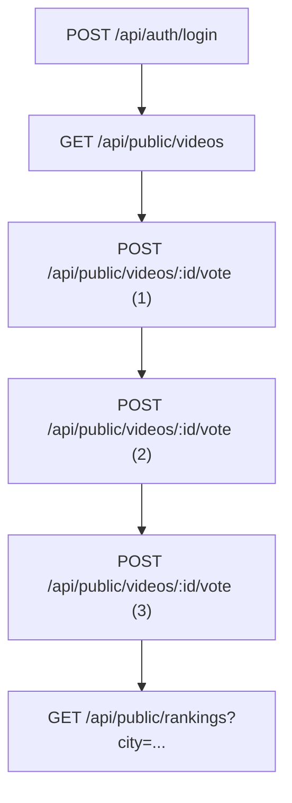
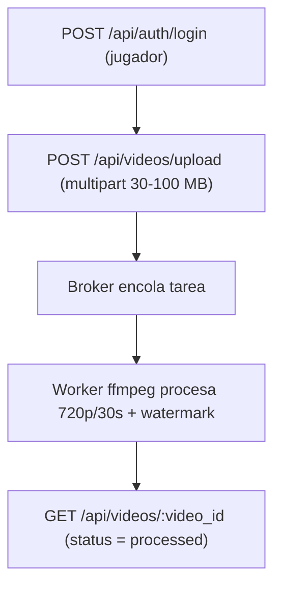

# Sistema-de-Videos-y-Ranking — Plan de Pruebas de Carga y Análisis de Capacidad (JMeter)

> **Versión:** 2.0 — 2025-09-28  
> **Proyecto:** Sistema-de-Videos-y-Ranking 
> **Responsable:** Equipo QA/DevOps  
> **Documento:** `plan_de_pruebas.md`

---

## 1. Lugar y formato de entrega
- **Repositorio:** `./capacity-planning/plan_de_pruebas.md`  
- **Recursos de prueba:** `./jmeter/` (plan `.jmx`, CSVs de datos)  
- **Evidencias:** `./results/{{escenario}}/` ( CSV, logs)  
- **Notas:** ejecutar JMeter, documentar comandos y parámetros.

---

## 2. Análisis de capacidad
**Objetivo:** asegurar que la plataforma soporte: 
- (a) **100 usuarios concurrentes** navegando y votando;
- (b) picos de **10 subidas concurrentes** con procesamiento asíncrono (transcoding 30 s, 720p, 16:9, sin audio y marca de agua).

**Mix horario pico (hipótesis inicial):**
- 60% `GET /api/public/videos`
- 20% `POST /api/public/videos/{{id}}/vote`
- 15% `GET /api/public/rankings`
- 5% autenticación (`POST /api/auth/login`)

**Riesgos/Cuellos de botella:** CPU/I/O en *workers* (ffmpeg), unicidad de voto en DB, ranking sin caché, *broker* de colas.

---

## 3. Definición de métricas
- **TG-Interactivo:** foco en **p95** por endpoint; objetivo inicial ≤ 1000 ms.
- **TG-Upload (ingestión multipart):** objetivo inicial **p95 ≤ 5 s**.
- **Tasa de éxito:** ≥ 95% por paso en ventanas de 10 s.
- **RPS / Concurrencia:** escalar por etapas manteniendo estabilidad (sin queues crecientes ni spikes de p95).

---

## 4. Escenarios (etapas y duraciones)
### 4.1 TG‑Interactivo (login → listar → votar×3 → ranking)

**Inicio sin carga:** rate(0/sec) durante 10 segundos.

**Carga inicial baja:** rate(10/sec) durante **1 minuto**.

**Incremento moderado:**
- Transición a rate(50/sec) en 10 segundos → Aumento de carga.
- Mantención de rate(50/sec) durante **1 minuto**.

**Carga alta:**
- Transición a rate(100/sec) en 10 segundos → Escalamiento a carga alta.
- Mantención de rate(100/sec) durante **1 minuto** → Se evalúa el rendimiento en condiciones exigentes.

**Descenso progresivo:**
- Reducción a rate(50/sec) en 10 segundos → Simulando disminución de tráfico.
- Mantención de rate(50/sec) durante **1 minuto.**.

**Vuelta a carga baja:**
- Reducción a rate(10/sec) en 10 segundos → Se simula el final de la jornada o baja demanda.
- Mantención de rate(10/sec) durante **1 minuto**.

### 4.2 TG‑Upload (login → upload multipart 30–100 MB)

**Inicio en reposo:**

- **Tasa:** rate(0/sec) 
- **Duración:** random_arrivals(10 sec) 
- **Objetivo**: establecer un punto de partida sin carga. 

**Incremento gradual de carga:**

- **Subida** a rate(2/sec) durante random_arrivals(2 min)
- Luego a rate(4/sec) durante random_arrivals(1 min) 
- Posteriormente a rate(6/sec) durante random_arrivals(1 min) 
- Finalmente a rate(10/sec) durante random_arrivals(1 min) 

**Descenso gradual de carga:**

- **Reducción** a rate(6/sec) durante random_arrivals(1 min) 
- Luego a rate(4/sec) durante random_arrivals(1 min) 
- Finalmente a rate(2/sec) durante random_arrivals(2 min) 

---

## 5. Entorno e infraestructura
- **Generador de carga (local):** i7‑12700H, 16 GB RAM, Windows 11 Pro 22H2.
- **Topología de la solución (AWS):** Front (t3.small), Back (t3.small), Worker (t3.large), RabbitMQ (t3.small),
  Redis‑EC2 (t3.small, sin IP pública), MinIO (t3.small), Bastion (t3.micro).
- **Observación metodológica:** El uso de cliente local puede sesgar los resultados (CPU/IO/red del cliente).
  Para pruebas de confirmación se recomienda un cliente dedicado EC2 (p. ej., c6i.xlarge).

---
  

## 6. Herramienta y **infraestructura requerida** (AWS Academy — Learner Lab)
**Herramienta:** **Apache JMeter 5.6.3** en **modo non-GUI**

**Plan de prueba (alto nivel):**
- **Thread Groups**:  
  - **TG-Interactivo**: login → listar → votar×3 → ranking (con *think time* 1–3 s).  
  - **TG-Upload**: login → upload multipart (30–100 MB).
- **Config Elements**: HTTP Defaults, Cookie/Header Managers, `CSV Data Set Config`, `User Parameters` (JWT).  
- **Post-Processors**: `JSON Extractor` (token), `Regex/JSON Extractor` (video_id).  
- **Timers**: `Uniform Random Timer` (1–3 s) para el escenario interactivo.  
- **Listeners**: `Simple Data Writer` (CSV).  

---

## 9. Escenarios de prueba (rutas críticas)

### Escenario 1 — Interactivo/Web
**Objetivo:** validar latencia y unicidad de voto con navegación realista.  
**Flujo:** login → listar → votar×3 → ranking.

**Validaciones:** 2xx, unicidad de voto (409/422 si reintento), p95 por paso, *think time* 1–3 s.

---

### Escenario 2 — Carga/Asíncrono (Uploads)
**Objetivo:** someter ingestión y pipeline asíncrono a concurrencia alta.  
**Flujo:** login → upload multipart

**Carga:** 100 jugadores subiendo en paralelo (en lotes).  
**Validaciones:** éxito ≥ 99.5%, latencias de ingestión, tamaño/edad de cola, tiempo medio de *transcoding*.

---

## 10. Estrategia y configuración de pruebas
**Etapas TG-Interactivo:**  
1) **Humo** (1 usuario, 1 min).  
2) **Carga progresiva**: 10 → 50 → 100 → 50 → 10 usuarios concurrentes (1 - 2 min por escalón).  
3) **Estrés**: subir hasta p95 > 1 s o error > 1%.

**Etapas TG-Upload:**  
1) **Humo** (1 usuario, 1 min).  
2) **Carga progresiva**: 2 → 4 → 6 → 10 → 6 → 4 → 2 usuarios concurrentes (1 - 2 min por escalón).  
3) **Estrés**: subir hasta p95 > 1 s o error > 1%.  

---

## 11. Tabla resumen (escenarios & resultados esperados)

| Escenario | Objetivo | Resultado esperado |
|---|---|---|
| Interactivo/Web | Latencia y unicidad de voto con 50 usuarios concurrentes | p95: login < 300 ms; listar < 2.5 s; voto < 500 ms; ranking < 600 ms; errores < 0.1% |
| Carga/Asíncrono | Sostenibilidad de *upload* + pipeline | ≥ 10 req/min en upload; éxito ≥ 99.5%; *transcoding* medio ≤ 30 s/job (4 workers) |

---

## 12. Gráficos simulados
**Throughput vs. Usuarios**  

**Tiempo de Respuesta p95 vs. Carga**  

