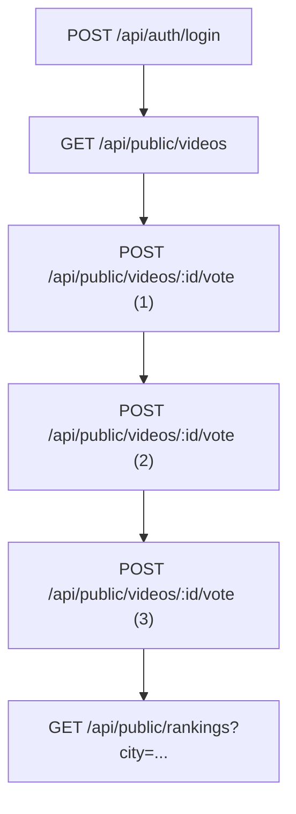
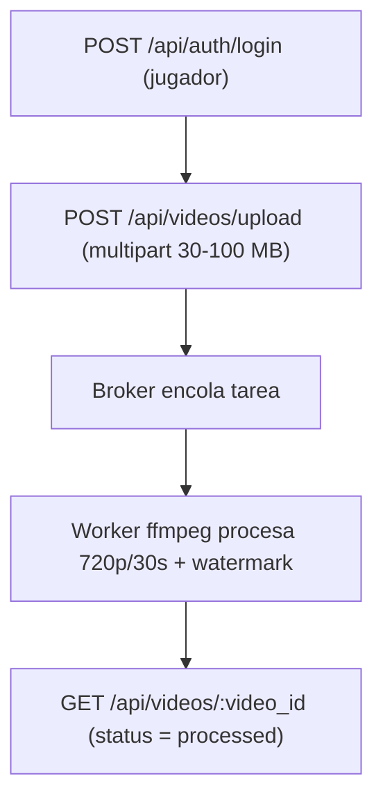
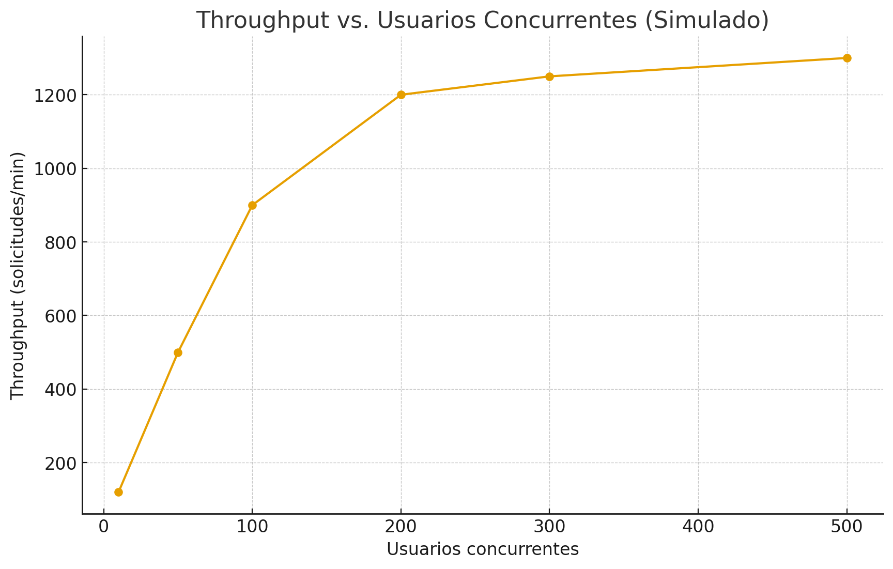
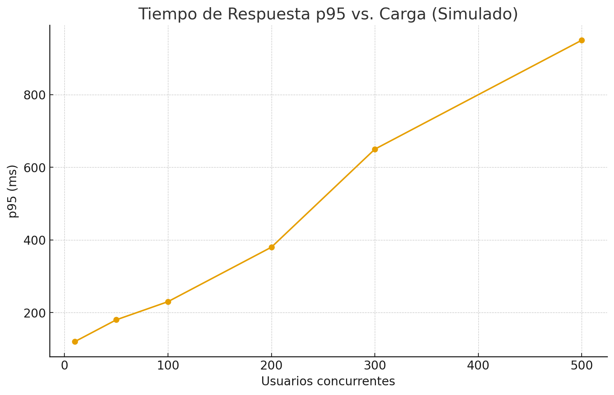

# ANB Rising Stars Showcase — Plan de Pruebas de Carga y Análisis de Capacidad (JMeter)

> **Versión:** 1.0 — 2025-09-07  
> **Proyecto:** ANB Rising Stars Showcase  
> **Responsable:** Equipo QA/DevOps  
> **Documento:** `plan_de_pruebas_jmeter.md`

---

## 1. Lugar y formato de entrega
- **Repositorio:** `./capacity-planning/plan_de_pruebas.md`  
- **Recursos de prueba:** `./jmeter/` (plan `.jmx`, CSVs de datos, scripts `run.sh`)  
- **Evidencias:** `./results/{{fecha}}/{{escenario}}/` (Dashboard HTML, CSV, logs)  
- **Notas:** ejecutar JMeter en **modo non-GUI**; documentar comandos y parámetros.

---

## 2. Análisis de capacidad
**Objetivo:** asegurar que la plataforma soporte: 
- (a) **200–300 usuarios concurrentes** navegando y votando;
- (b) picos de **100 subidas concurrentes** con procesamiento asíncrono (transcoding 30 s, 720p, 16:9, sin audio y marca de agua).

**Mix horario pico (hipótesis inicial):**
- 60% `GET /api/public/videos`
- 20% `POST /api/public/videos/{{id}}/vote`
- 15% `GET /api/public/rankings`
- 5% autenticación (`POST /api/auth/login`)

**Riesgos/Cuellos de botella:** CPU/I/O en *workers* (ffmpeg), unicidad de voto en DB, ranking sin caché, *broker* de colas.

---

## 3. Definición de métricas
**Capacidad de procesamiento**
- *Throughput* por endpoint (req/min) y *jobs/min* en *workers*.

**Tiempos de respuesta**
- Percentiles **p50/p90/p95/p99** por endpoint (foco en **p95**).

**Utilización y salud**
- CPU/RAM por servicio (API, DB, broker, workers), I/O disco/red, errores 4xx/5xx, *timeouts*, *retry/DLQ*, tamaño/edad de cola.

---

## 4. Respuestas a preguntas orientadoras
- **Carga objetivo:** **200 usuarios concurrentes** sostenida, picos **300 usuarios concurrentes**; **100 uploads** concurrentes por ventanas.
- **Cuello de botella:** *workers* de vídeo y **DB** (unicidad de voto); ranking sin caché.
- **Estrategia de escalado:** **API/workers** horizontales; **DB** con índices y *pool*; *broker tuning* (prefetch, ack).
- **Degradación aceptable:** `p95 < 500 ms` a 200 usuarios concurrentes; `p95 < 900 ms` a 300 usuarios concurrentes; *upload* (ingestión) `p95 < 1.2 s`.
- **Controles:** idempotencia de voto, *rate limiting*, caché de `rankings` (TTL 1–5 min), **DLQ** y *backoff* en *workers*.

---

## 5. Consideraciones importantes
- **Voto único** por usuario/video con índice único en DB e idempotencia en el endpoint.
- **Uploads** directos a almacenamiento (signed URLs) y validación de tipo/tamaño.
- **Concurrencia de workers** fijada a núcleos/CPU disponibles; colas separadas para *upload* y *transcoding*.
- **Observabilidad** desde el día 1 (métricas, logs y trazas).

---

## 6. Herramienta y **infraestructura requerida** (AWS Academy — Learner Lab)
**Herramienta:** **Apache JMeter 5.6.x** en **modo non-GUI**; Dashboard HTML.

**Plan de prueba (alto nivel):**
- **Thread Groups**:  
  - **TG-Interactivo**: login → listar → votar×3 → ranking (con *think time* 1–3 s).  
  - **TG-Upload**: login → upload multipart (30–100 MB).
- **Config Elements**: HTTP Defaults, Cookie/Header Managers, `CSV Data Set Config`, `User Parameters` (JWT).  
- **Post-Processors**: `JSON Extractor` (token), `Regex/JSON Extractor` (video_id).  
- **Timers**: `Uniform Random Timer` (1–3 s) para el escenario interactivo.  
- **Listeners**: `Simple Data Writer` (CSV) + **Dashboard HTML** al final.  
- **Opcional**: `Backend Listener` hacia InfluxDB/Grafana.

**Instancia EC2 recomendada (cliente de carga):** **c6i.xlarge** (4 vCPU, 8 GB RAM, red 10 Gbps).  
- **Motivos**: hasta ~500–800 hilos ligeros con *think time*; margen para TLS/JSON; ancho de banda suficiente para 100 uploads concurrentes.  
- **JVM**: `HEAP=-Xms1g -Xmx4g`, `-XX:+UseG1GC`.  
- **Disco (EBS gp3)**: **30 GB** (resultados CSV/HTML, artefactos de vídeo sintético y logs).  
- **SO**: `ulimit -n >= 65535`, *sysctl* TCP, swap deshabilitada si es viable.
- **Alternativa costo/beneficio** (si 200 usuarios concurrentes máx. y 50 uploads): **m6i.large** (2 vCPU, 8 GB, 10 Gbps).

---

## 7. Entorno de pruebas y topología
- **Cliente de carga (EC2 Learner Lab)**: JMeter non-GUI dedicado.  
- **Servidor de aplicación**: API + Nginx + DB + broker + workers (entorno de pruebas).  
- **Red**: dentro de la misma región/zona para latencias < 2–3 ms; vigilar *throughput* en uploads.  
- **Tiempo**: NTP habilitado para correlación de métricas.

---

## 8. Criterios de aceptación (ANB)
- `POST /api/public/videos/{{id}}/vote` → **p95 < 300 ms**, error < 0.1%.  
- `GET /api/public/videos` → **p95 < 350 ms** a 300 usuarios concurrentes.  
- `GET /api/public/rankings` → **p95 < 400 ms**.  
- `POST /api/videos/upload` → **≥ 50 req/min** sostenidos; **p95 < 1.2 s** (ingestión).  
- **Servidor app CPU** < 80% a 200 usuarios concurrentes; **workers** con *transcoding* medio ≤ 30 s/clip (720p/30s).  
- **Integridad de voto único**: 0 violaciones en campañas masivas.

---

## 9. Escenarios de prueba (rutas críticas)

### Escenario 1 — Interactivo/Web
**Objetivo:** validar latencia y unicidad de voto con navegación realista.  
**Flujo:** login → listar → votar×3 → ranking.

**Validaciones:** 2xx, unicidad de voto (409/422 si reintento), p95 por paso, *think time* 1–3 s.

---

### Escenario 2 — Carga/Asíncrono (Uploads)
**Objetivo:** someter ingestión y pipeline asíncrono a concurrencia alta.  
**Flujo:** login → upload multipart → *polling* opcional hasta `processed`.

**Carga:** 100 jugadores subiendo en paralelo (en lotes).  
**Validaciones:** éxito ≥ 99.5%, latencias de ingestión, tamaño/edad de cola, tiempo medio de *transcoding*.

---

## 10. Estrategia y configuración de pruebas
**Etapas:**  
1) **Humo** (5–10 usuarios, 5 min).  
2) **Carga progresiva**: 10 → 50 → 100 → 200 → 300 usuarios concurrentes (10–15 min por escalón).  
3) **Estrés**: subir hasta p95 > 1 s o error > 1%.  
4) **Soak**: 60–120 min a 200 usuarios concurrentes (filtrar *warm-up* en análisis).

**Configuración JMeter:** non-GUI; `HEAP 1–4 GB`; sin listeners en vivo; `Simple Data Writer` a CSV; **Dashboard HTML** al final; `CSV Data Set` para credenciales/IDs; `Throughput Controller` si se ejecutan TG combinados; `Backend Listener` opcional.

**Monitoreo y profiling:** Grafana/Prometheus (node_exporter, postgres_exporter, redis_exporter, cadvisor), logs centralizados (Loki/ELK), pprof/APM si está disponible.

---

## 11. Tabla resumen (escenarios & resultados esperados)

| Escenario | Objetivo | Resultado esperado |
|---|---|---|
| Interactivo/Web | Latencia y unicidad de voto con 200–300 usuarios concurrentes | p95: login < 250 ms; listar < 350 ms; voto < 300 ms; ranking < 400 ms; errores < 0.1% |
| Carga/Asíncrono | Sostenibilidad de *upload* + pipeline | ≥ 50 req/min en upload; éxito ≥ 99.5%; *transcoding* medio ≤ 30 s/job (4 workers) |

---

## 12. Gráficos simulados
**Throughput vs. Usuarios**  

**Tiempo de Respuesta p95 vs. Carga**  

---

## 13. Anexos
- Plan `.jmx` (JMeter) de ambos escenarios; CSVs; `run.sh` (non-GUI + dashboard).  
- Guía de *tuning* de SO y JMeter para alto volumen.
