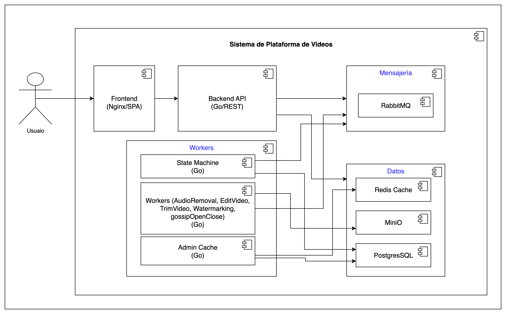
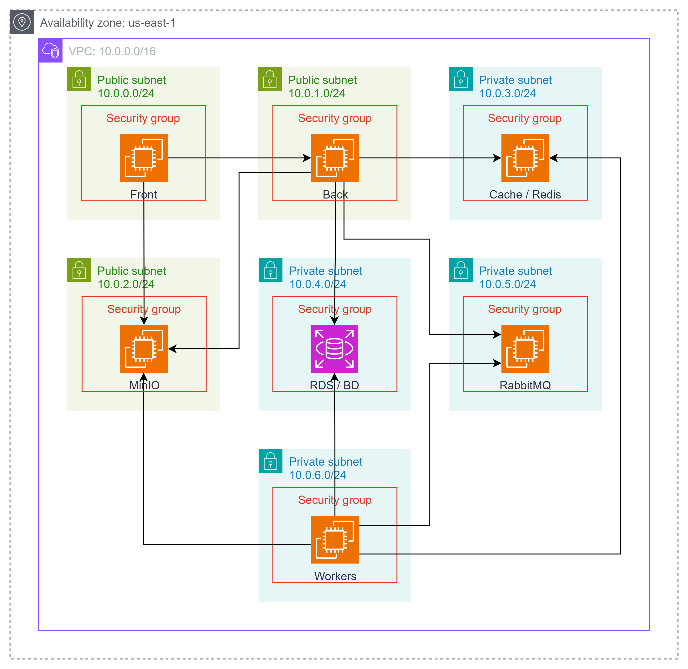

# Arquitectura de Migración a la Nube

[Documento base pdf](https://drive.google.com/file/d/1Tp4nY7XF09juAGXBzTFp1rY2o9fx0npL/view?usp=sharing) (Equivalente a lo que se presenta en el readme):

A continuación, se describen los ajustes realizados y la arquitectura de la migración a la nube, además de una breve descripción de los servicios y tecnologías AWS usadas.

Dada la necesidad de la migración a instancias EC2, se acopló la arquitectura inicial a instancias, cada una enfocada a una parte específica del sistema. Así, el funcionamiento básico hace lo siguiente: el Front habla con una API BFF que orquesta (vía RabbitMQ) un conjunto de workers de video; los artefactos viven en MinIO, el estado y la metadata en PostgreSQL, y el rendimiento/UX se apoya en Redis (estado y ranking con *Sorted Sets*). Todo corre en EC2 con SGs que exponen sólo lo mínimo.

## Componentes por instancias, base de datos y aplicación

- **EC2 Back**: contiene el backend de la aplicación o el API, lo que permite que el Front apunte a los endpoints objetivo.  
- **EC2 Front**: contiene el frontend o parte gráfica de la aplicación. La conexión entre front y back se realiza por REST.  
- **EC2 Workers**: contiene el orquestador (state machine) y los workers de procesamiento de video, que realizan tareas como corte, agregación de marca de agua, ajuste de resolución y eliminación de audio.  
- **EC2 RabbitMQ**: instancia de mensajería para manejar las solicitudes de procesamiento de video.  
- **EC2 MinIO**: almacenamiento de los videos originales y procesados.  
- **EC2 Redis Cache**: encargado de la gestión de cache en memoria para mejorar la velocidad de acceso.  

Los cambios más relevantes se realizaron en el manejo de los Dockerfile, para desplegar cada parte de forma independiente en las instancias EC2. El código base solo requirió ajustes menores, principalmente relacionados con la parametrización de variables que estaban definidas de forma estática.

---

## 1) Capas y Componentes

### Presentación
- **Frontend (SPA en Nginx):** entrega los archivos estáticos y consume la API REST. No tiene lógica de negocio.

### Aplicación (BFF + Jobs)
- **Backend API (Go/REST):** BFF para el front. Expone endpoints para subir videos, consultar estado, y leer rankings. Publica mensajes a la cola, lee/escribe cache y metadata.  
- **Workers (Go):** procesos especializados para tareas de media: *audio removal, trim, edit, watermarking, open/close*, etc.  
- **State Machine / Orquestador:** coordina el pipeline de cada video ( `(uploaded-> trim video → edit video→ audio removal →watermarking-> gossip(cortinilla)->procesamiento finalizado `), encadena pasos y reintentos.  
- **Admin Cache:** job de mantenimiento que recalienta/invalida caches (listas, conteos, rankings).  

### Mensajería
- **RabbitMQ (AMQP 5672):** desacopla API y workers. La API publica trabajos; los workers consumen, reportan progreso y devuelven eventos.

### Datos
- **MinIO (S3-like, API 9000):** almacena los objetos (videos originales y derivados).  
- **PostgreSQL (5432):** metadata y estado transaccional (usuarios, videos, trabajos, métricas agregadas persistentes).  
- **Redis (6379):** cache caliente para lecturas de alta frecuencia (listas, estados, rankings) y estructuras como *Sorted Sets* para ranking.  

### Infraestructura
- **EC2 dedicadas:** Front, Back, Worker, Redis, RabbitMQ, MinIO y un bastion. Todo dentro de una VPC con SGs que exponen sólo lo necesario (p. ej., 80/443 al Front, 8080 al Back, 5672 interno a workers/API, 6379/5432/9000 privados).

---

## 2) Flujos principales

### A. Ingesta y procesamiento de video
1. **Upload:** el usuario sube el archivo (directo a MinIO con *pre-signed URL* o vía API, que luego lo coloca en MinIO).  
2. **Encolar:** la API guarda metadata inicial en PostgreSQL, actualiza Redis con estado `QUEUED`, y publica un mensaje en RabbitMQ con el `job_id` y pasos requeridos.  
3. **Consumo:** un worker toma el mensaje, descarga del MinIO, ejecuta la etapa (p. ej., trim), sube el artefacto resultante a MinIO.  
4. **Estado/Progreso:** el worker actualiza PostgreSQL (auditoría y trazabilidad) y Redis (estado y % progreso) y emite un evento para la siguiente etapa de la state machine.  
5. **Orquestación:** la State Machine encadena etapas (uploaded-> trim video → edit video→ audio removal →watermarking-> gossip(cortinilla)->procesamiento finalizado). En caso de error, reintento/backoff; si falla de forma definitiva, marca `FAILED`.  
6. **Finalización:** con éxito, queda `READY` y se disparan tareas de post-proceso (generación de previews, actualización de índices/rankings).  

### B. Lectura y ranking de videos
1. **Consulta:** el Front llama a la API para listados y *leaderboards*.  
2. **Cache-first:** la API lee Redis (ej., `ZREVRANGE rank:global 0 99 WITHSCORES`).  
3. **Miss:** si no está, la API calcula/lee de PostgreSQL, rehidrata Redis (TTL/invalidación) y responde.  
4. **Actualización de ranking:** eventos (views, likes, watch-time) llegan a la API o a un worker de métricas; ese proceso incrementa puntajes en Redis (p. ej., `ZINCRBY`) y de forma asíncrona consolida en PostgreSQL (para históricos/reportes).  

> **Heurística del ranking típica:** función ponderada (ej. `score = α*likes + β*views + γ*watch_time – δ*penalización_por_antigüedad`) con *decay* temporal. Redis *Sorted Sets* facilitan TOP-N y *paging*.

---

## 3) Contratos y puertos

- **AMQP 5672:** API → publicar; Workers → consumir/publicar progreso.  
- **Redis 6379:** API y Workers para cache/colas ligeras/locks.  
- **S3 API 9000 (MinIO):** objetos multimedia.  
- **PostgreSQL 5432:** metadata/estado y consolidación de métricas.  

---

## 4) Escalabilidad y resiliencia

- Escala horizontal en **Workers** (picos de procesamiento) y **API** (lecturas).  
- **RabbitMQ** amortigua picos.  
- Idempotencia de jobs: usa claves de *dedup*, *locks* en Redis y marcas de etapa en Postgres para reintentos seguros.    
- Caches con TTL + invalidación por evento (p. ej., al terminar un job o cambiar un conteo).  
- Separación de responsabilidades: objetos en MinIO, control en PostgreSQL, hot path en Redis.  

---

## 5) Seguridad y redes

- **Front** público (80/443).  
- **Back** accesible sólo desde Front/ALB y bastion.  
- **RabbitMQ, Redis, Postgres, MinIO** privados (SGs internos).  
- **Credenciales:** secretos (SSM/Secrets Manager) para DB, MinIO y RabbitMQ.  
- **HTTPS** extremo a extremo y *pre-signed URLs* para subida/descarga.  

---

## 6) Observabilidad y operación

- **Health checks:** API y workers (*liveness/readiness*).  
- **Métricas:** colas (lag), tasa de jobs, duración por etapa, errores, CPU/IO (transcode).  
- **Trazas:** correlación por `job_id` en API, workers y mensajes (OpenTelemetry).  
- **Logs centralizados:** CloudWatch.  
- **Backups:** snapshots de Postgres y *lifecycle* en MinIO.  

---

## 7) Modelo de componentes

---

## 8) Modelo de despliegue

---

## 9) Conclusiones

La arquitectura presentada combina desacoplamiento mediante mensajería, uso de almacenamiento especializado para objetos, y cache de alto rendimiento para mejorar la experiencia del usuario. La orquestación de workers permite escalar horizontalmente el procesamiento intensivo de videos, mientras que Redis soporta el cálculo rápido de rankings. PostgreSQL garantiza consistencia y trazabilidad de datos.  

Esta separación de responsabilidades, junto con la observabilidad y seguridad en la infraestructura, hacen que el sistema sea robusto, escalable y confiable.  

A pesar del ejercicio de arquitectura y la implementación, las pruebas de carga presentaron algunos errores que se estarán revisando para la siguiente entrega.
