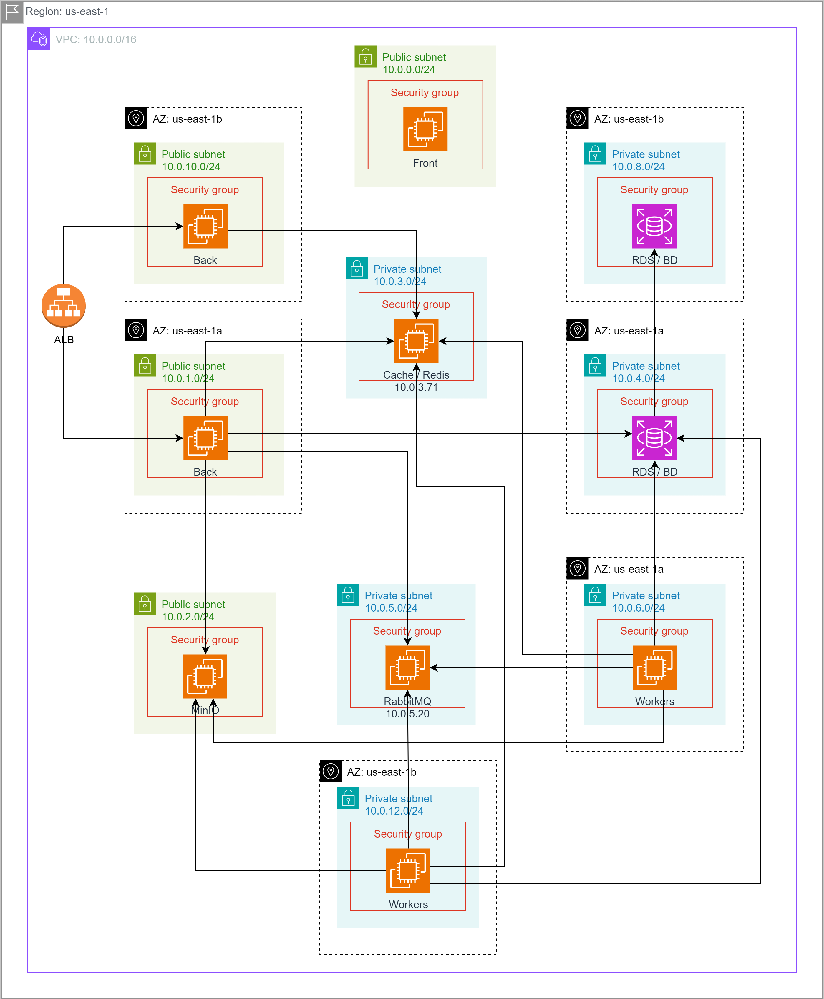

# Arquitectura para implementación de soluciones escalables en la nube

En este apartado se señalan los cambios realizados en la tercera entrega respecto a la arquitectura e infraestructura.

Por un lado se conserva la cola o broker que recibira las peticiones y que enviara a la zona de trabajo o workers por medio del API. 

## Componentes por instancias, base de datos y aplicación

- **EC2 Back**: contiene el backend de la aplicación o el API, lo que permite que el Front apunte a los endpoints objetivo.  
- **EC2 Front**: contiene el frontend o parte gráfica de la aplicación. La conexión entre front y back se realiza por REST.  
- **EC2 Workers**: contiene el orquestador (state machine) y los workers de procesamiento de video, que realizan tareas como corte, agregación de marca de agua, ajuste de resolución y eliminación de audio.  
- **EC2 RabbitMQ**: instancia de mensajería para manejar las solicitudes de procesamiento de video.  
- **S3**: Se cambia la forma de almacenar los videos originales y resultado por un almacenamiento S3, antes se usaba una instancia EC2 con MinIO.  
- **EC2 Redis Cache**: encargado de la gestión de cache en memoria para mejorar la velocidad de acceso.  
- **Monitoreo**: cloudwatch para verificar el comportamiento de las pruebas, aca cobra mayor importancia por la necesidad del autoescalado.

## Pruebas de Carga

Para ver las pruebas de Carga:
[Entrega 3-pruebas](../../capacity-planning/DocPruebasEntrega3/pruebas_de_carga_entrega3.md)

## Comparación de vistas de despliegue

### Arquitectura Entrega 3 VS Arquitectura Entrega 2

| Aspecto                                  | **Despliegue v1** (2ª imagen)                                                                     | **Despliegue v2** (1ª imagen)                                                                                           |
| ---------------------------------------- | ------------------------------------------------------------------------------------------------- | ----------------------------------------------------------------------------------------------------------------------- |
| **Zonas de disponibilidad (AZ)**         | Usa una sola AZ (`us-east-1a`).                                                                   | Usa dos AZ (`us-east-1a` y `us-east-1b`), logrando **alta disponibilidad (HA)**.                                        |
| **Subredes**                             | Tiene subredes públicas y privadas en una sola AZ.                                                | Duplica las subredes públicas y privadas en ambas AZ, siguiendo buenas prácticas de resiliencia.                        |
| **Balanceador de carga (ALB)**           | No está explícitamente representado.                                                              | Incluye un **Application Load Balancer (ALB)** que distribuye tráfico hacia los nodos “Back” en ambas zonas.            |
| **Escalabilidad horizontal**             | Limitada a una sola AZ, por lo tanto el escalado es vertical o parcial.                           | Soporta escalado horizontal en múltiples zonas. Por ejemplo, “Workers” y “Back” están replicados.                       |
| **Disponibilidad y tolerancia a fallos** | Un único punto de fallo en cada componente. Si la AZ falla, toda la aplicación cae.               | Alta tolerancia a fallos: los componentes críticos (Back, Workers, BD) están redundados en AZ distintas.                |
| **Capa de datos (RDS / BD)**             | Un solo RDS en una subred privada (10.0.4.0/24).                                                  | RDS desplegado en subredes privadas de dos AZ (10.0.4.0/24 y 10.0.8.0/24), configurado probablemente como **Multi-AZ**. |
| **Mensajería (RabbitMQ)**                | Solo una instancia en una subred privada.                                                         | RabbitMQ desplegado en subred privada redundada. Puede soportar clúster o replicación.                                  |
| **Cache / Redis**                        | Una sola instancia en una subred privada.                                                         | Instancia Redis en una AZ pero dentro de un esquema redundante general, pudiendo crecer a cluster Redis.                |
| **Front / Back separation**              | Claramente definida. Front en público, Back en privado con conexión directa a BD, Rabbit y Redis. | Igual separación, pero con mayor aislamiento de seguridad y rutas a través de ALB.                                      |
| **Workers**                              | Una sola instancia en una subred privada.                                                         | Múltiples instancias distribuidas entre AZ, mejorando la capacidad de procesamiento paralelo.                           |
| **Seguridad y segmentación de red**      | Seguridad básica con subred pública/privada.                                                      | Más detallada: múltiples *security groups* interconectados por componente, con flujos explícitos entre capas.           |

## Cambios relevantes a nivel de implementación 

### Resumen ejecutivo
- Se reemplazó la capa de almacenamiento basada en MinIO por un backend compatible con Amazon S3.
- La API de entrega de video fue refactorizada para transmitir contenido por streaming, evitando la carga completa de los archivos en memoria.

### Cambios técnicos
- Sustitución de librerías de conexión: migración del cliente MinIO al SDK S3.
- Acceso a objetos multimedia mediante operaciones nativas de S3 (incluyendo soporte de `GET` con cabeceras de rango).
- API de video con respuesta en streaming: lectura por chunks, manejo de `Range`/`Content-Range` y `Accept-Ranges: bytes`.
- Reducción del uso de memoria en el servidor al eliminar el buffering completo de archivos de video.

### Justificación
- Escalabilidad: S3 ofrece durabilidad, disponibilidad y throughput adecuados para cargas de video.
- Eficiencia: el streaming minimiza el consumo de memoria y mejora la latencia percibida.
- Compatibilidad: el protocolo S3 mantiene portabilidad frente a proveedores compatibles.

### Implicaciones arquitectónicas
- La API actúa como pasarela de streaming, delegando el almacenamiento masivo a S3.
- Se habilita entrega parcial de contenido (seek y reanudación), mejorando la experiencia de reproducción.
- Menor acoplamiento con el proveedor original y mayor alineación con estándares S3.

### Configuración requerida
- Variables de entorno:
  - `AWS_ACCESS_KEY_ID`, `AWS_SECRET_ACCESS_KEY`, `AWS_REGION`.
  - `S3_BUCKET` (bucket objetivo).
  - Opcional para endpoints compatibles: `S3_ENDPOINT`, `S3_FORCE_PATH_STYLE=true`.
- Políticas de bucket: permisos de `s3:GetObject` para la API y, si aplica, `s3:PutObject`/`s3:AbortMultipartUpload` para cargas/worker.

### Plan de migración
- Crear/configurar el bucket en S3 y credenciales con privilegio mínimo.
- Sincronizar objetos existentes (si había datos en MinIO) usando herramientas de copia compatibles con S3.
- Actualizar variables de entorno y reiniciar servicios.
- Verificar reproducción con y sin cabecera `Range` y confirmar headers: `Accept-Ranges: bytes`, `Content-Type: video/*`.

### Evaluación de desempeño
- Memoria: reducción del uso de RAM por solicitud al cambiar buffering por streaming.
- Latencia inicial: mejora por entrega de los primeros bytes sin esperar la descarga completa.
- Throughput: dependiente del ancho de banda de S3 y de la política de concurrencia del servidor.

### Riesgos y mitigaciones
- Costos de egreso de S3: monitorear y aplicar caching/CDN si el patrón de acceso lo amerita.
- Timeouts/redes: configurar reintentos y timeouts del cliente S3.
- Compatibilidad de rangos: pruebas con reproductores que usan `Range` de forma agresiva.

### Trabajo futuro
- Integración con CDN para edge caching de segmentos.
- Multipart upload y reintentos para cargas robustas desde workers.
- Métricas detalladas (p95 latencia, bytes servidos, errores S3) para capacity planning.
