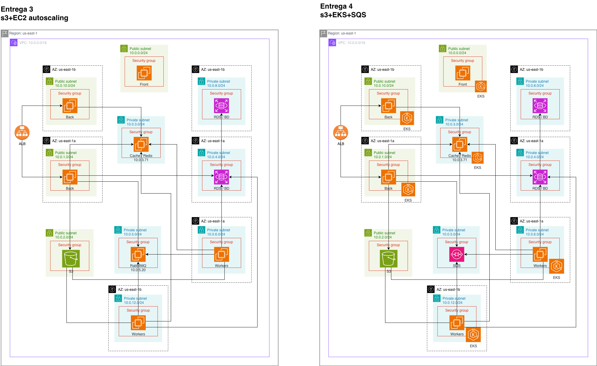

# Arquitectura para implementación con EKS y colas SQS
Los cambios entre la entrega 3 y la entrega 4 tienen que ver con la forma en que se dispone el back, los workers y el front en un cluster de EKS.
A continuación se realiza una exposición aproximada de los cambios y componentes que se ven en esta entrega.

## Pruebas de Carga

Para ver las pruebas de Carga:
[Entrega 4-pruebas](../../capacity-planning/DocPruebasEntrega4/pruebas_de_carga_entrega4.md)

## Componentes por instancias, base de datos y aplicación

 El diagrama compara dos arquitecturas que resuelven lo mismo con enfoques distintos de cómputo y acoplamiento.

# Qué muestra cada lado

**Entrega 3 — S3 + EC2 Auto Scaling**

* VPC con varias AZ, subredes públicas (ALB/Frontend) y privadas (Backend/DB/Workers).
* ALB expone el sitio; instancias **EC2** en **Auto Scaling Groups** sirven **frontend** y **backend**.
* S3 para estáticos/archivos. (Eventualmente cache/DB en subred privada).
* Escalamiento “a lo grueso”: se levantan/terminan **instancias completas**.

**Entrega 4 — S3 + EKS + SQS**

* Misma base de red (multi-AZ, públicas/privadas) pero el cómputo va en **EKS** (pods/servicios).
* ALB (vía Ingress Controller) publica los **services** del clúster.
* Se introduce **SQS** como **cola central**: los servicios publican eventos y **workers** (pods) los consumen.
* Escalamiento “fino”: **HPA** escala **pods** y (opcional) Karpenter/Cluster Autoscaler añade nodos cuando hace falta.

---

# Comparación punto a punto

| Tema                              | Entrega 3 (EC2 ASG)                                                        | Entrega 4 (EKS + SQS)                                                                                         |
| --------------------------------- | -------------------------------------------------------------------------- | ------------------------------------------------------------------------------------------------------------- |
| **Acoplamiento**                  | Sin cola: frontend→backend sincrónico. Procesos largos tienden a bloquear. | **Desacoplado**: peticiones encoladas; backend puede responder rápido y delegar trabajo a **consumidores**.   |
| **Escalamiento**                  | Por **instancias** (minutos). Sobre-provisión frecuente.                   | Por **pods** (segundos) + nodos según demanda. Escala más elástica y granular.                                |
| **Resiliencia a picos**           | Picos impactan directamente la latencia del backend.                       | La **cola** absorbe picos (buffer) y suaviza la carga; con **DLQ** se aíslan mensajes problemáticos.          |
| **Paralelismo / throughput**      | Limitado por el número de instancias y procesos por VM.                    | Controlado por el **número de consumidores** y la **concurrencia** de cada pod.                               |
| **Observabilidad y autosanación** | ASG repone VMs; procesos caídos requieren supervisión propia.              | Kubernetes **recrea pods**, readiness/liveness probes, **HPA** por CPU/QPS/colas.                             |
| **Seguridad**                     | SG por instancia. IAM por instancia.                                       | **IRSA** (IAM por servicio/pod), políticas más finas; NetworkPolicies entre pods.                             |
| **Complejidad operativa**         | Menor: VM + deploy por ASG.                                                | Mayor: **clúster**, Ingress, controladores, upgrades, malla de servicios opcional.                            |
| **Costo**                         | Sin fee de control-plane, pero escalas en bloques de VM.                   | Fee del **control-plane EKS** y controladores; compensas con mejor **utilización** (pods). **SQS** es barato. |
| **Patrones de error**             | Retries ad-hoc; riesgo de timeouts bajo carga.                             | **Procesamiento asíncrono** con reintentos, **idempotencia** y **DLQ**; menor riesgo de timeouts al usuario.  |
| **Time-to-market**                | Rápido para MVPs/monolitos.                                                | Ideal al crecer: microservicios, pipelines y cargas batch/event-driven.                                       |

# Flujo

**Entrega 3**

1. Usuario → ALB → EC2 (Front) → EC2 (Back).
2. Back lee/escribe en S3/DB.
3. Tareas pesadas viven en el mismo back o en “workers” EC2; si sube la demanda, compite con tráfico web.

**Entrega 4**

1. Usuario → ALB/Ingress → Servicio en EKS.
2. Servicio **publica mensaje** en **SQS** y responde rápido al usuario.
3. **Pods consumidores** procesan en segundo plano (escalan con HPA), leen/escriben S3/DB; errores a **DLQ**.

# Implicaciones prácticas (lo que gana/pierde tu equipo)

* **Menor latencia percibida y mayor resiliencia** en Entrega 4 por el patrón asíncrono y la autosanación de Kubernetes.
* **Control del costo**: EKS añade coste fijo pero permite **densidad** (más trabajo por nodo) y escalar por pods; SQS te evita sobredimensionar para picos.
* **Operación**: EKS requiere **buenas prácticas** (IRSA, Ingress Controller, HPA/Karpenter, Prometheus/Grafana/CloudWatch, políticas de red, upgrades planificados).
* **Diseño de aplicación**: con SQS necesitas **idempotencia**, **deduplicación**, contratos de mensajes y monitoreo de **profundidad de cola**.

# Conclusiones

Ambas arquitecturas cumplen, pero optimizan cosas distintas.
**Entrega 3 (S3 + EC2 Auto Scaling)** privilegia la simplicidad operativa y el “time-to-market”: es ideal para un MVP o una carga web relativamente estable, con pocos procesos pesados y un equipo pequeño. Escala en bloques de VM, por lo que ante picos puede sobreaprovisionar y aumentar latencia.

**Entrega 4 (S3 + EKS + SQS)** añade complejidad inicial y disciplina operativa, pero a cambio ofrece elasticidad fina (pods), desacoplamiento por eventos, mayor resiliencia a picos (buffer de la cola), mejor paralelismo y patrones de robustez (reintentos, DLQ, idempotencia). Suele dar mejor utilización y costo por unidad de trabajo cuando la demanda es variable y hay tareas de backend intensivas.

**Regla práctica:**

* Si necesitas salir rápido, con carga predecible y poco procesamiento asíncrono → **Entrega 3**.
* Si esperas picos, múltiples servicios, trabajos largos en segundo plano o un roadmap a microservicios/event-driven → **Entrega 4**.

Estrategia recomendada: diseñar desde hoy contratos de eventos e idempotencia; si empiezas en EC2, deja lista la interfase de mensajería para migrar gradualmente a **EKS + SQS** cuando la escala y los picos lo justifiquen.

